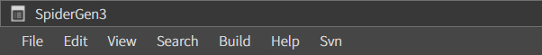

# 02. 구성

스파이더젠의 구성은 크게 메인메뉴와 프로젝트뷰, 레이아웃영역, 프로퍼티뷰, 컴포넌트뷰 등으로 나뉘어져 있습니다.  

version. 3.0.6

## A. Main Menu
메인 메뉴는 스파이더젠의 최상단에 위치합니다. 구성은 File, Edit, View, Search Build, Help, Source Control로 구성되어 있습니다.

## B. Project Pane
프로젝트 뷰는 기본적으로 가장 좌측에 위치하며 프로젝트의 폴더 및 파일의 구성을 트리 형태로 보여줍니다.

프로젝트 뷰의 위치는 Drag&Drop으로 이동 가능합니다.

프로젝트 내의 파일 및 폴더도 Drag&Drop으로 이동이 가능하며 마우스 우측버튼 클릭을 통해서 새 폴더 및 파일 생성, 파일 불러오기 기능이 가능합니다.  

### Folders
스파이더젠의 프로젝트 내 폴더는 가상 폴더로 물리적으로 프로젝트 내 존재하지 않거나 동일한 폴더명으로 매칭되지 않을 수 있습니다.

* **Framework :** 스파이더젠에서 사용되는 프레임워크가 로드되는 폴더 입니다. 기본적으로 afc 프레임워크가 로드 됩니다.
* **Library :** 스파이더젠의 시스템 라이브리 및 외부 라이브러리가 로드되는 폴더입니다.
* **Template :** 테마 및 디자인 템플릿 파일이 로드되는 폴더 입니다.
* **Query :** TR 통신을 위한 매핑정보 파일들이 로드되는 폴더 입니다.
* **Assets :** 리소스 파일이 로드되는 폴더 입니다. 해당 폴더는 프로젝트 빌드시 컴파일 되지 않으며 원본이 유지 됩니다.
* **Source :** 레이아웃 파일(.lay) 및 클래스 파일(.cls)이 로드 되는 폴더입니다.

## C. Layout View
레이아웃 뷰는 스파이더젠 컴포넌트들을 이용해서 UI 및 화면을 개발 할 수 있는 위지위그(wysiwyg) 편집툴입니다.
 
레이아웃 뷰는 좌측에 레이아웃 트리뷰와 컴포넌트 편집기로 구성되어 있으며 레이아웃 트리는 컨트롤들의 레이어(Layer) 상하 위치를 Drag&Drop으로 변경 할 수 있습니다.  

  

### Perspective
각 컴포넌트의 깊이를 시각적으로 확인할 수 있도록 투시 형태의 뷰를 제공합니다.

### Location Point
레이아웃에 가이드 포인트를 표시해 줍니다.  

### Tab Order
레이아웃에 설정된 컴포넌트들의 tab 순서를 설정하는 모드를 제공합니다. 

### Layout Line
레이아웃 컴포넌트(GridLayout, FlexLayout)들의 레이아웃 라인을 표시해 줍니다. 

### Unit Mode
레이아웃 상태에서 컴포넌트의 반응을 확인 할 수 있습니다.  

### Position Info
선택한 컴포넌트와 다른 각 컴포넌트와의 상대적 위치값을 표시해 줍니다.

### Show Class Mode
컴포넌트 클래스 이름을 보여줍니다. 

### Show Style Mode
컴포넌트 스타일 값을 보여줍니다.

### Show Event Mode
컴포넌트 이벤트 이름을 보여줍니다.

### Show Name Mode
컴포넌트의 Name을 보여줍니다.

### Show Query Mode
컴포넌트에 매핑된 쿼리 이름을 보여줍니다.

## D. Properties Pane
Properties Pane 은 **Class Pane, Appearance Pane, Placement Pane**으로 구성되며 각 Pane의 위치는 Drag&Drop으로 변경 할 수 있습니다.

### a. Class Pane
Class Pane은 컴포넌트의 **Identity, Event, Query, Mask, ToolTip, Cursor Type** 등의 속성값을 설정 할 수 있습니다.

     

#### Identity
컴포넌트의 구분 및 유일성을 위한 ID, Group, TabIndex, Z-index, CRUD 값을 설정 할 수 있습니다.  

* **Class :** 컴포넌트의 클래스명 (Base Class)  
* **ID :** 컴포넌트를 구분하기 위한 유일한 아이디  
* **Group :** 컴포넌트를 그룹화하기 위한 그룹 아이디  
* **TabIndex :** 컴포넌트의 탭 순서  
* **Z-Index :** 컴포넌트의 레이어(Layer) 값  
* **CRUD :** CRUD 매핑 값 (CRUD를 위한 서버 연동시 적용됨)  

#### Event
컴포넌트의 이벤트를 설정 할 수 있습니다. 설정하기 위한 이벤트 컬럼을 더블클릭하면 이벤트를 설정할 수 있습니다.

#### Query  
컴포넌트에 매핑된 쿼리를 설정 및 수정 할 수있습니다.  

#### Mask  
컴포넌트에 마스킹을 설정할 수 있습니다. add 버튼을 클릭하면 사용 가능한 마스크 리스트를 확인 할 수 있습니다.  

#### ToolTip  
컴포넌트에 툴팁을 설정 할 수 있습니다. Message에 툴팁에 노출될 내용을 입력하세요.

#### Cursor Type
컴포넌트의 마우스 커서를 설정 할 수 있습니다.

### b. Appearance Pane
Appearance Pane은 컴포넌트만의 특징적 속성과 일반적인 속성(**Background, Boarder, Font, Padding**등)을 설정 할 수 있습니다.  

각 컴포넌트의 속성 설정은 해당 컴포넌트 설명 부분에서 확인해주세요.

#### Style
미리 저장해둔 스타일을 사용할 수 있습니다.

#### Display
보여주기 속성을 설정합니다.

* **Opacity**: 투명도를 설정합니다. (0 ~ 1)

#### BackGround
배경 속성을 설정합니다.

#### Font
글자 속성을 설정합니다.

#### Border
테두리 속성을 설정합니다.

#### BoxShadow
컴포넌트의 그림자 속성을 설정합니다.

#### TextShadow
글자의 그림자 속성을 설정합니다.

#### Transform
컴포넌트의 변형 속성을 설정합니다.

### c. Placement Pane
Placement pane은 컴포넌트의 위치, 사이즈, 마진 값을 설정 할 수 있습니다.

 

#### Tools  
선택된 컴포넌트들를 정렬합니다.

#### Position  
컴포넌트의 위치를 설정합니다. 픽셀 또는 %로 설정이 가능합니다. 

#### Size  
컴포넌트의 크기를 설정합니다. 픽셀 또는 %로 설정이 가능합니다.  

* **auto :** 크기를 auto로 설정합니다.
* **stretch :** Width가 설정되어 있을 경우는 Left 또는 Right, Height가 설정되어 있을 경우는 Top, Bottom 설정값을 기준으로 상대편 간격 값을 설정 할 수 있습니다.  

#### Margin  
컴포넌트의 마진 값을 설정 할 수 있습니다.

#### Padding
컴포넌트의 패딩 값을 설정 할 수 있습니다.

#### Layout
컴포넌트의 레이아웃 속성을 설정합니다.

## E. Components Pane
컴포넌트뷰는 스파이더젠에서 기본적으로 제공하는 컴포넌트가 리스트로 보여지며 기본 컴포넌트외 추가 컴포넌트는 탭뷰(mdfc)로 제공됩니다.  

컴포넌트뷰 하단에는 컴포넌트를 쉽게 찾을 수 있는 컴포넌트 검색기를 제공하고 있습니다. 

 

각 컴포넌트의 특별한 속성은 API에서 확인할 수 있습니다.