# 02. 메인메뉴

메인메뉴는 스파이더젠의 최상단에 위치합니다.  

구성은 **File, Edit, View, Search Build, Help, Svn**으로 구성되어 있습니다.  

## A. File

스파이더젠 프로젝트 및 파일관련 메뉴입니다.  

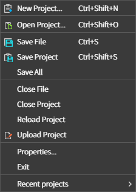

### New Project  
새 프로젝트를 생성하는 메뉴입니다.  

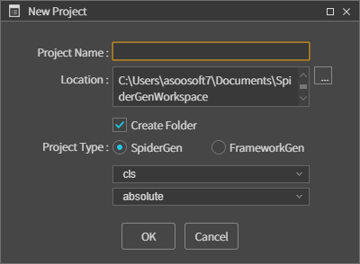 

* **Project Name :** 새 프로젝트명을 설정합니다.  
* **Location :** 프로젝트가 저장될 위치를 설정합니다.  
* **Create Folder :** 체크 시 프로젝트 이름으로 Location 위치에 폴더를 생성하고 그 하위에 프로젝트 파일들 생성합니다.
* **Project Type :** 프로젝트의 타입을 설정합니다.

### Open Project  
프로젝트를 오픈 합니다. 프로젝트 파일 확장자는 .prj 입니다.  
  
### Save File  
현재 선택된 파일을 저장합니다.  
  
### Save Project  
현재의 프로젝트를 저장합니다.  
  
### Save All  
현재 프로젝트에서 수정 중인 모든 파일 및 프로젝트 모든 상태를 저장합니다. 
  
### Close Project  
현재 작업 중인 프로젝트를 닫습니다.  
  
### Reload Project  
현재 프로젝트를 다시 로드합니다.  
  
### Properties..  
프로젝트의 환경설정을 설정합니다.  
H. Properties에 자세한 설명이 있습니다.
  
### Exit  
스파이더젠을 종료합니다.  
  
### Recent projects  
최근 로드했던 프로젝트의 리스트를 보여줍니다.  

## B. Edit
스파이더젠 명령 재실행 및 취소 기능입니다.  

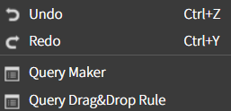 

### Undo  
명령을 취소합니다.  
  
### Redo  
취소된 명령을 재실행합니다.  

### Query Maker
쿼리에 대한 설정(추가, 수정, 삭제)을 할 수 있는 쿼리메이커 화면을 띄웁니다.

### Query Drag&Drop Rule
쿼리 필드명에 디자인된 컴포넌트와 매핑할 컴포넌트를 설정하는 화면을 띄웁니다.

설정 후 프로젝트뷰에서 쿼리파일을 lay 에 Drag&Drop 하면 지정된 컴포넌트가 추가됩니다.

> 참고
 * tlay 파일에 디자인된 뷰 또는 컴포넌트에 아이디를 지정한 경우 목록에 표현되며 설정할 수 있습니다.
 * lay 를 구성한 후 쿼리매핑을 하는 반복 작업에 사용하면 시간을 단축시킬 수 있습니다.

## C. View

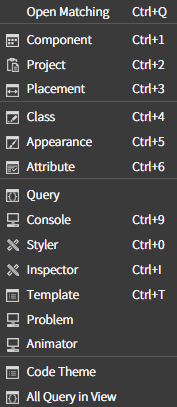 

### Open Matching  
클래스 파일(*.cls) 또는 레이아웃 파일(* .lay)에 매칭되는 클래스 또는 레이아웃 파일을 오픈하거나 이미 오픈 되어 있을 경우 현재 작업중인 파일로 활성화 합니다.  
해당 기능은 레이아웃 뷰의 상단의 탭바에서 현재 활성화된 탭을 더블 클릭할 경우에도 동일한 기능을 수행합니다.  

### Component  
Component Pane이 비활성화(Hide)되어 있을 경우 활성화(Show) 합니다.  

### Project  
Project Pane이 비활성화(Hide)되어 있을 경우 활성화(Show) 합니다.  

### Placement  
Placement Pane이 비활성화(Hide) 되어 있을 경우 활성화(Show) 합니다.  
 
### Class  
Class Pane이 비활성화(Hide) 되어 있을 경우 활성화(Show) 합니다.  

### Appearance  
Appearance Pane이 비활성화(Hide) 되어 있을 경우 활성화(Show) 합니다.

### Attribute
Attribute Pane이 비활성화(Hide) 되어 있을 경우 활성화(Show) 합니다.

### Query  
Query Pane이 비활성화(Hide)되어 있을 경우 활성화(Show)합니다.  
Query는 현재 프로젝트에 추가된 모든 쿼리 파일 목록과 각 쿼리 파일의 내용을 볼 수 있습니다.  
그리고 lay 화면의 컴포넌트에 쿼리 파일 또는 내용을 Drag&Drop 하여 쿼리를 등록할 수 있습니다.

### Console  
Console Pane이 비활성화(Hide)되어 있을 경우 활성화(Show)합니다.      
      
### Styler
Styler Pane이 비활성화(Hide)되어 있을 경우 활성화(Show)합니다.  

### Inspector
Inspector Pane이 비활성화(Hide)되어 있을 경우 활성화(Show)합니다.  
Inspector는 lay 파일에서 선택한 컴포넌트의 HTML, ClassList, CSS 를 확인, 추가, 제거할 수 있는 뷰입니다. 단, HTML 의 내용은 수정이 불가능합니다.

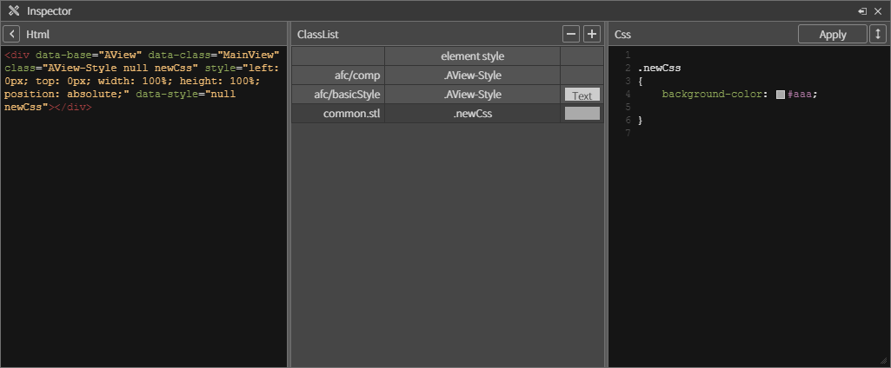

### Template
Template이 비활성화(Hide)되어 있을 경우 활성화(Show)합니다.  

### Problem
Problem Pane이 비활성화(Hide)되어 있을 경우 활성화(Show)합니다.  

### Animator
Animator Pane이 비활성화(Hide)되어 있을 경우 활성화(Show)합니다.  

### Code Theme
Code Theme이 비활성화(Hide)되어 있을 경우 활성화(Show)합니다.  

      

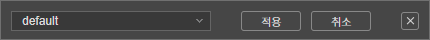

### All Query in View  
현재 화면에 매핑된 모든 Query 정보를 확인 할 수 있고 설정 할 수 있습니다.  

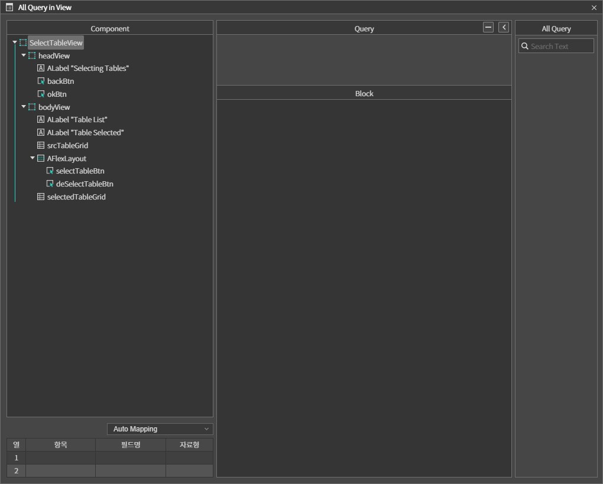 

### a. Pane Docking
스파이더젠에서는 두가지의 Pane 도킹 방식을 제공하고 있습니다.  

먼저 Pane의 헤더를 클릭해서 드래그(Drag)합니다. 그러면 도킹 가능한 영역표시기가 보여지고 원하는 영역에 드롭(Drop)하게 되면 해당 영역에 순차적으로 도킹하게 됩니다.

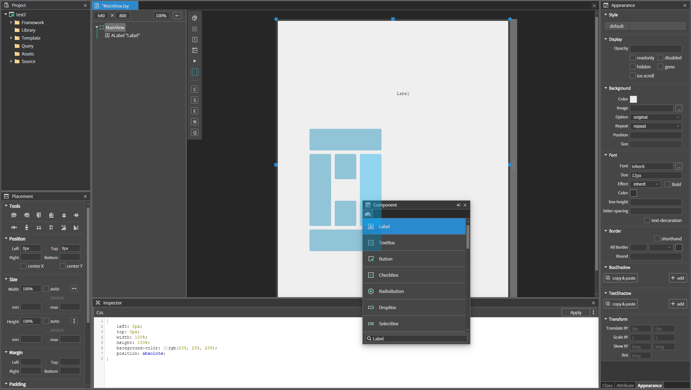 

도킹 후 Pane이 이전에 도킹되어 있는 Pane의 하단에 위치한 것을 확인할 수 있습니다.  

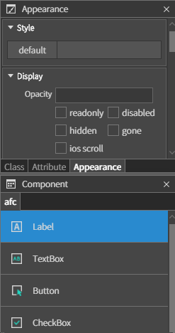 

이번에는 도킹 가능 영역 표시기를 이용하지 않고 직접 툴 화면에 도킹 가능한 영역(상하좌우)에 도킹을 하게되면 이번 도킹되어 있던 Pane들과 함께 탭뷰 형태로 위치하게 됩니다. 

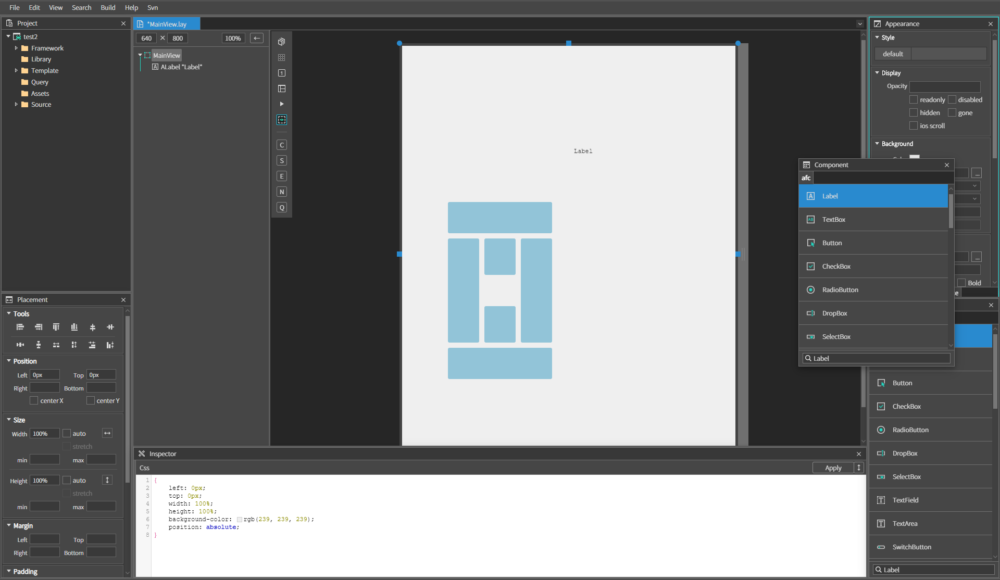 

도킹 후 Pane이 탭뷰 형태로 위치한걸 확인 할 수 있습니다.

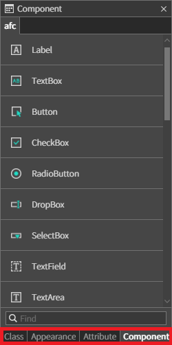 

## D. Search 
현재 프로젝트에서 파일을 찾기 위한 메뉴입니다.

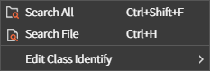 

### Search All  
현재 프로젝트에서 검색할 파일 타입(.js, .css, .cls, .lay …)을 설정하고 검색하고자 하는 문자열이 포함된 모든 파일을 검색 할 수 있는 도킹이 가능한 메뉴 Pane입니다.  

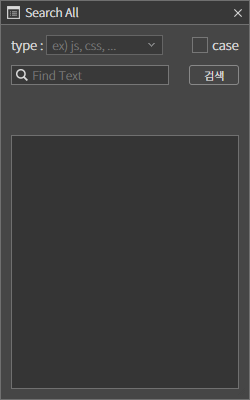 

* **case :** 선택시 대소문자를 구분합니다.

### Search File  
현재 프로젝트에서 파일명으로 파일을 검색 할 수 있는 도킹이 가능한 메뉴 Pane입니다.  

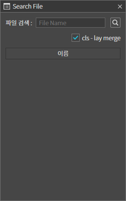 

* **cls - lay merge :**  클래스 파일(*.cls)과 레이아웃 파일(* .lay)을 하나로 취급하여 검색합니다.

### Edit Class Identify

해당 보기모드

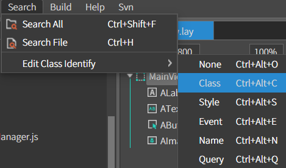 

#### ex) class 선택 시

class보기 모드 실행

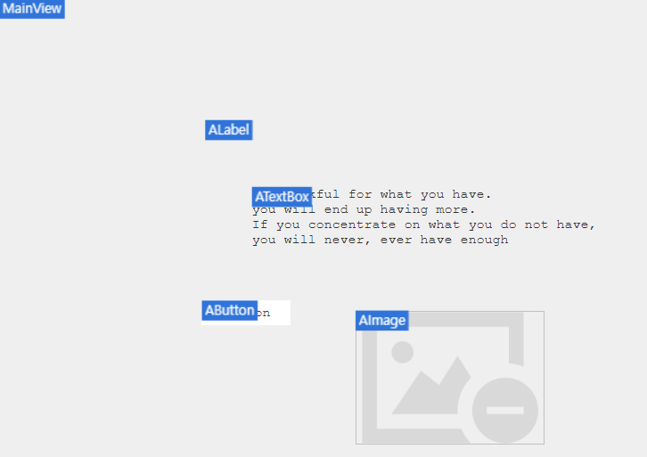 

## E. Build
현재 프로젝트를 전체 또는 화면 단위별로 빌드하거나 동시에 실행할 수 있는 메뉴입니다.

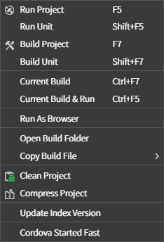 

### Run Project  
현재 프로젝트를 빌드 후 실행하는 메뉴입니다.
 
### Run Unit  
현재 활성화된 화면을 실행하는 메뉴입니다. (해당 메뉴를 실행하기전 프로젝트가 빌드되어 있어야 함)
 
### Build Project  
현재 프로젝트를 빌드하는 메뉴 입니다. 빌드된 파일은 현재프로젝트/bin 폴더에 저장됩니다.  

### Build Unit  
현재 활성화된 화면을 빌드합니다.  

### Current Build  
현재 활성화된 파일을 빌드합니다.  

### Current Build & Run  
현재 활성화된 파일을 빌드 후 실행합니다.  

### Run As Browser
빌드 후 브라우저에서 실행합니다.

### Open Build Folder
현재 빌드된 파일들이 있는 폴더를 엽니다.

### Copy Build File - Set Target Folder
현재 빌드 된 파일들을 복사하여 다른 위치에 저장합니다.

### Clean Project  
현재 프로젝트 빌드 파일을 삭제합니다.  

### Compress Project  
현재 빌드된 프로젝트 파일을 압축합니다. (해당 메뉴는 프로젝트 빌드 후 사용합니다.)  

### Update Index Version  
현재 프로젝트를 빌드 후 생성되는 Index.html 버전을 관리하는 기능입니다.

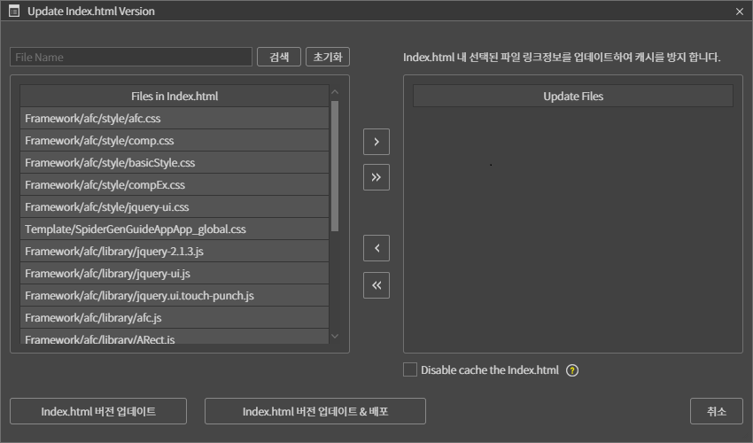 

### Cordova Started Fast
코르도바 프로젝트를 만들 수 있는 기능입니다.

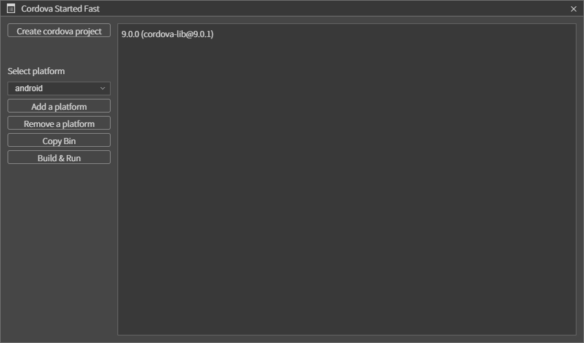 

* **Create cordova project :** 코르도바 프로젝트를 생성합니다.
* **Select platfrom :** 플랫폼을 설정합니다.
* **Add a platform :** 기존 목록에 없는 플랫폼을 추가합니다.
* **Copy Bin :** bin 폴더를 복사합니다.
* **Build & Run :** 빌드 후 실행합니다.

<!--
### Cloud Login

Index.html에는 프레임워크 관련 파일들(**.js**, **.html**, **.css**)이 링크됩니다.  
따라서 수정 사항이 발생한 프레임워크 파일들 버전관리가 필요 할 경우 해당 파일을 
우측 목록으로 이동시켜 빌드합니다. 

해당 기능은 웹앱의 경우 브라우저가 캐시를 사용하게 될 경우 수정된 프레임워크 파일을 새로이 적용하기 위해 적합 합니다.
-->

## F. Help

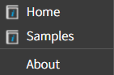 

### Home
스파이더젠 홈페이지로 이동합니다.

### Sample
스파이더젠 샘플예제를 받을 수 있는 깃허브 페이지가 오픈됩니다.( 동영상 강의 예제 포함)

### About 
스파이더젠의 저작권 및 소유권 버전을 소개합니다.  

## G. SVN
형상관리 모드일 경우 노출되는 메뉴입니다. 

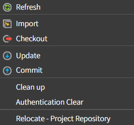 

* **Refresh :** 형상관리 상태를 새로고침 하는 기능입니다.
* **Update :** 형상관리 상태에서 Update가 필요한 모든 파일을 일괄 Update 받게 해주는 기능입니다.
* **Commit :** 형상관리 상태에서 Commit이 필요한 모든 파일을 일괄 Commit 하게 해주는 기능입니다. 충돌방지 모드에서는 노출되지 않습니다.
* **Delete** 형상관리 상태에서 폴더를 삭제하는 기능입니다. 충돌방지 모드에서는 노출되지 않습니다.
* **Lock** Lock 상태를 설정하는 기능입니다. 충돌방지 모드에서는 노출되지 않습니다.

## H. Properties
프로퍼티스는 스파이더젠과 프로젝트의 옵션을 설정하는 기능입니다.  

해당 메뉴의 위치는 메인메뉴 **File > Properties**에 위치합니다.  

### a. Project Prop 
프로젝트의 옵션을 설정하는 기능을 제공합니다.  

### General  
프로젝트의 기본 요소를 설정하는 기능입니다.  

 

* **Project Path :** 현재 프로젝트의 폴더 위치입니다.   
* **AutoScale :** 설정 시 meta의 viewport 정보를 다음과 같이 설정합니다.  
> <mata name="viewport" content=" **width=device-width**, ..  
* **Default Scale :** AutoScale을 설정하지 않을 경우 입력한 값의 비율로 meta 정보를 등록합니다.  
> <mata name="viewport" content=".. , **initial-scale=설정값** ..
* **Default Scale :** meta tag의 초기화면 배율을 설정합니다. 
* **Tablet min-width :** 태블릿으로 인식하는 최소 가로 길이를 설정합니다.
* **Document Width :** 모바일 장치별 가로 길이를 설정합니다.
    * **Phone**
    * **Tablet**
* **Query Format :** 쿼리 파일의 포맷을 설정합니다.
* **User Scalable :** 사용자의 확대/축소 기능을 meta정보에 등록합니다.  
> <mata name="viewport" content=" ..., **user-scalable=설정값(no or yes)**
* **Responsive Lay :** Mobile/PC 환경에 따라 layout을 동적으로 로드합니다.
* **Default Layout Size :** 기본 레이아웃 크기를 설정합니다.

### Build  
프로젝트 빌드 요소를 설정하는 메뉴입니다.  

 

* **기본으로 로드되는 js 파일들을 하나의 파일로 합칩니다.**
* **빌드되는 모든 파일을 난독화 합니다.**
* **stl 스타일이 엘리먼트 스타일보다 우선(!important)되게 합니다.**
* **Native Bridger :** 하이브리드 모바일앱 개발시 네이티브와의 통신을 위한 브릿지를 설정하는 기능입니다. 
    * **none**
    * **cordova**
* **index.html Title :** 웹앱의 타이틀 설정 기능입니다.
* **Sub Folder :** index.html의 하위 폴더로 빌드됩니다.
* **Output Path :** 빌드한 파일들을 저장할 경로입니다.
* **Script Tage&Link Tag :** 프로젝트 빌드시 생기는 index.html에 추가로 등록하고 싶은 script나 link를 설정하는 기능입니다. 
* **프레임웍 로딩**
    * **수동으로 컴포넌트를 로딩합니다.**
    * **화면이 로딩될 때, 현재 화면에서 사용된 컴포넌트를 로딩합니다.**
    * **프로그램이 시작될 때, 모든 화면에서 사용된 컴포턴트를 로딩합니다.**
    * **프로그램이 시작될 때, 프레임웍의 모든 컴포넌트를 로딩합니다.**
    
### Deployment  
현재 프로젝트의 배포를 위한 환경을 설정하는 기능입니다.  

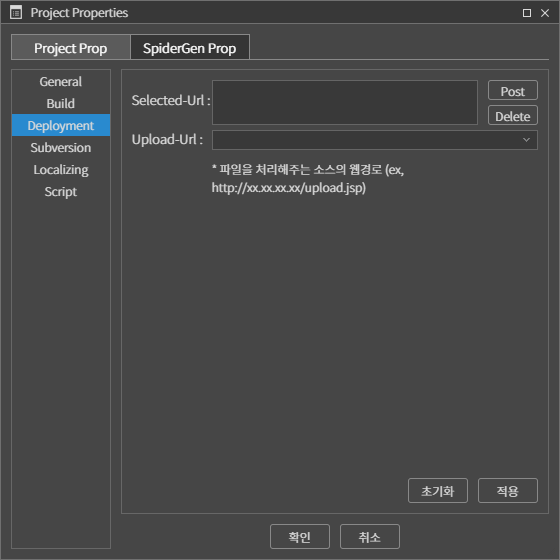 

* **Selected-Url :** 프로젝트의 결과물을 배포할 url을 입력하고 등록(Post) 또는 삭제(Delete)하는 기능입니다.  
* **Upload-Url :** 입력된 배포 url중 현재 선택한 url입니다.    
  
### Subversion  
형상관리 저장소를 저장하는 기능입니다.  

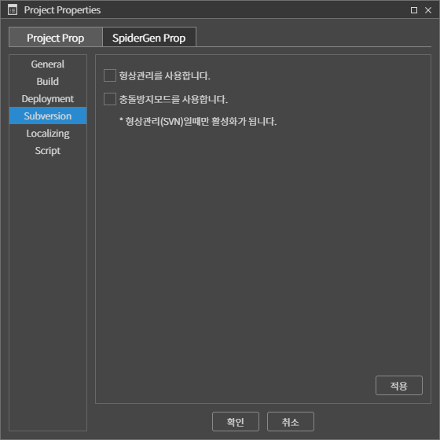 

* **형상관리를 사용합니다.**
* **충돌방지모드를 사용합니다. :** 형상관리 상태의 그룹 작업시 소스 충돌방지를 위한 기능입니다.  

### Localizing  
다국어 기능을 설정합니다.

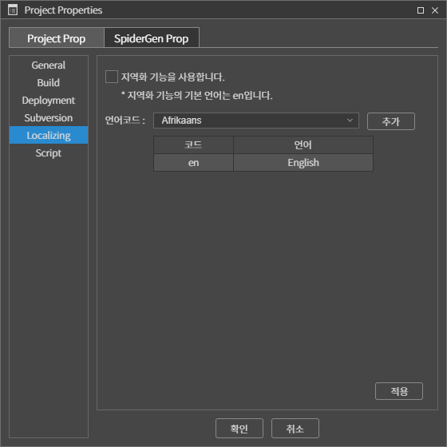 

* **지역화 기능을 사용합니다. :** 다국어 기능을 설정합니다.  
* **언어코드 :** 지원할 다국어를 선택 추가 합니다. 

### Script
빌드 전, 빌드 후에 호출되는 명령어를 작성합니다.

### b. SpiderGen Prop

### System  

스파이더젠의 Workspace와 코드테마를 설정하는 기능입니다.  

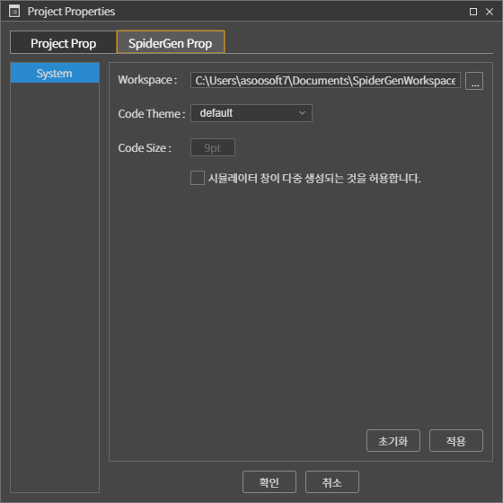 

* **Workspace :** 스파이더젠에서 프로젝트를 생성할 때 기본적으로 저장되는 Workspace 위치를 설정하는 기능입니다.
* **Code Theme :** 스파이더젠의 코드 테마를 설정할 수 있는 기능입니다. 
* **Code Size :** 스파이더젠의 코드 폰트 크기를 설정할 수 있는 기능입니다.
* **시뮬레이터 창이 다중 생성되는 것을 허용합니다.**