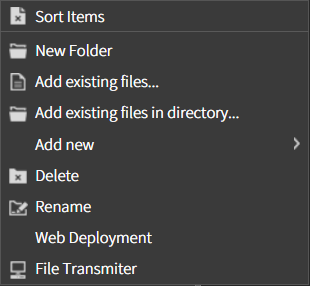
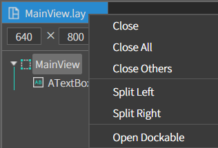
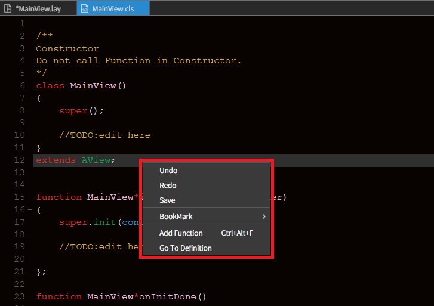

# 03. 컨텍스트 메뉴

스파이더젠에서는 다양항 컨텍스트 메뉴를 제공하고 있습니다. 

각 위치별 메뉴별 컨텍스트 메뉴를 확인하세요. 

# A. Context Menu in Project Pane
프로젝트 뷰의 프로젝트 트리에서 제공되는 컨텍스트 메뉴입니다. 

프로젝트 트리의 컨텍스트 메뉴는 선택된 폴더에 따라 각각 다른 내용의 메뉴를 제공합니다. 

## a. on Root folder
프로젝트 트리 루트 폴더(Root folder)의 컨텍스트 메뉴입니다. 

 

### New Folder
새 폴더를 생성하는 기능입니다. 

### Add existing files... 
프로젝트 폴더내 물리적으로 존재하는 파일을 프로젝트에 로드하고 오픈하기 위한 기능입니다. 

### Add existing files in directory... 
물리적으로 존재하는 폴더 내의 모든 파일을 프로젝트에 로드하고 오픈하는 기능입니다. 

### Add new 
새로운 파일을 생성하는 기능입니다. 

 

* **View :** 새 화면 파일(*.cls, *.lay)을 생성하는 기능입니다. 
* **Layout :** 새 레이아웃 파일(*.lay)을 생성하는 기능입니다. 
* **Class :** 새 클래스 파일(*.cls)을 생성하는 기능입니다.  
* **Format**

### Save Project 
현재의 프로젝트를 저장하는 기능입니다. File > Save Project 메뉴와 동일합니다. 

### Close Project 
현재의 프로젝트를 닫는 기능입니다. File > Close Project 메뉴와 동일합니다. 

### Reload Project 
현재의 프로젝트를 새로 로드하는 기능입니다. File > Reload Project 메뉴와 동일합니다. 

### Open folder 
현재 프로젝트 위치의 폴더를 오픈하는 기능입니다. 

### Properties... 
프로젝트 및 스파이더젠의 옵션을 설정할 수 있는 다이얼로그를 오픈하는 기능입니다. 

### Web Deployment 
프로젝트의 결과물을 배포하기 위한 다이얼로그를 오픈하는 기능입니다.  

 

### File Transmiter
원격 저장소(선택한 url)로 전송합니다.

 

### Source Control 
현재 프로젝트가 형상관리 모드일 경우 노출 되며 형상관리 주요 기능을 실행 할 수 있습니다.

 

* **Refresh :** 현재 형상관리 상태를 새로고침 하는 기능입니다.
* **Update :** 현재 프로젝트에서 Update가 필요한 모든 파일을 일괄 Update 받게 해주는 기능입니다. update를 실행하면 프로젝트를 다시 로그할지 문의하는 다이얼로그가 실행됩니다.
* **Commit :** 현재 프로젝트에서 Commit이 필요한 모든 파일을 일괄 Commit 하게 해주는 기능입니다. Commit을 실행하면 코멘트를 등록 할 수 있는 다이얼로그가 실행됩니다.
* **Show log :** 형상관리 로그를 확인 할 수 있는 다이얼로를 실행하는 기능입니다.

### Project Save Server  
형상관리 충돌방지모드일 경우 노출되는 메뉴입니다. 실행하면 프로젝트파일(.prj)에 대한 권한을 얻고 성공하게 되면 수정된 프로젝트파일(.prj)을 저장소에 저장합니다.

## b. on Framework folder
Framework 폴더에서 제공되는 컨텍스트 메뉴입니다.  

 

### Add Framework...  
프레임워크를 추가 팝업을 오픈합니다.  
프레임워크 추가는 오픈된 팝업에서 프레임워크 리스트를 선택(더블클릭)하면 현재 프로젝트로 추가됩니다.  

 

### Web Deployment  
Framework 폴더 내의 모든 파일을 설정된 배포 URL로 배포합니다.  

### File Transmiter
원격 저장소(선택한 url)로 전송합니다.

## c. on Framework node
프로젝트에 추가된 프레임워크 노드에서 제공하는 컨텍스트 메뉴입니다. 

 

### Default Load Settings...
기본적으로 로드하는 프레임워크 노드를 설정합니다.

 

### Web Deployment
프레임워크 노드를 설정된 배포 URL로 배포 합니다.

### File Transmiter
원격 저장소(선택한 url)로 전송합니다.

## d. on Library Folder
Library 폴더에서 제공되는 컨텍스트 메뉴입니다.

 

### New Folder 
Library 폴더 내에 새 폴더를 생성하고 추가하는 기능입니다. 오픈된 다이얼로그에서 폴더명을 입력하고 실행하면 새폴더가 추가 됩니다.

 

* **Create physical directory :** 물리적 위치에 폴더를 생성합니다.

### Add System LIB
스파이더젠 시스템에서 라이브러리를 추가하는 기능 입니다. 오픈된 다이얼로그에서 추가할 라이브러리를 더블클릭으로 선택하면 추가됩니다. 

 

### Add existing files...
외부 Library를 파일 단위로 추가하는 기능입니다.  
선택시 파일탐색기 창이 오픈되고 선택한 라이브러리가 추가됩니다.

### Add existing files in directory...
외부 Library를 폴더 단위로 추가하는 기능입니다.  
선택시 파일탐색기 창이 오픈되고 선택한 라이브러리가 추가됩니다.

### Add new
새로운 파일을 생성하는 기능입니다. 

 

* **Class :** 새 파일(*.cls)을 생성하는 기능입니다.
* **Format :** 새 파일(*.fmt)을 생성하는 기능입니다.
* **Javascript :** 새 파일(*.js)을 생성하는 기능입니다.

### Delete
Library 폴더를 삭제하는 기능입니다. 오픈된 다이얼로그에서 예를 선택하면 프로젝트에서 삭제됩니다. 파일삭제를 선택하면 프로젝트에서 삭제되고 물리적인 파일도 삭제됩니다.

### Rename
폴더명을 변경하는 기능입니다. 오픈된 다이얼로그에서 변경할 폴더명을 입력하고 저장하면 폴더 이름이 변경됩니다.

### Web Deployment
Library 폴더 내의 모든 라이브러리 파일을 설정된 배포 URL로 배포합니다. 

### File Transmiter
원격 저장소(선택한 url)로 전송합니다.

### SVN Commands
형상관리 모드일 경우 노출되는 메뉴입니다. 

 

* **Refresh** 형상관리 상태를 새로고침 하는 기능입니다.
* **Update** 형상관리 상태에서 Update가 필요한 모든 파일을 일괄 Update 받게 해주는 기능입니다.
* **Commit** 형상관리 상태에서 Commit이 필요한 모든 파일을 일괄 Commit 하게 해주는 기능입니다. 충돌방지 모드에서는 노출되지 않습니다.
* **Delete** 형상관리 상태에서 폴더를 삭제하는 기능입니다. 충돌방지 모드에서는 노출되지 않습니다.
* **Lock** Lock 상태를 설정하는 기능입니다. 충돌방지 모드에서는 노출되지 않습니다.

## e. on Template folder
Template 폴더에서 제공되는 컨텍스트 메뉴입니다.

 

### New Folder
Template 폴더 안에 새로운 폴더를 생성하는 기능입니다. 오픈된 다이얼로그에 추가할 폴더명을 입력하고 실행하면 Template 폴더 안에 새로운 폴더가 생성됩니다. 

 

### Add existing files...
Template 폴더내에 이미 물리적으로 존재하는 파일을 로드하는 기능입니다. 

### Add existing files in directory...
Template 폴더내에 이미 물리적으로 존재하는 폴더를 로드하는 기능입니다. 

### Add new
새로운 파일을 생성하는 기능입니다.

 

* **Template :** 새 Template를 생성하는 기능입니다. 오픈된 다이얼로그에서 템플릿 이름을 입력하고 실행하면 .tlay 파일이 생성됩니다. 
* **Style :** 새 스타일 파일을 생성하는 기능입니다. 오픈된 다이어로그에서 스타일 이름을 입력하고 실행하면 .stl 파일이 생성됩니다. 
* **Font :** 새 폰트 파일을 생성하는 기능입니다. 오픈된 다이얼로그에서 폰트 이름을 입력하고 실행하면 .ffl 파일이 생성됩니다.

### Delete 
Template 폴더를 삭제하는 기능입니다. 

### Rename
Template 폴더명을 변경하는 기능입니다. 

### Web Deployment 
Template 폴더내 모든 파일을 설정된 배포 URL로 배포하는 기능입니다. 

### File Transmiter
원격 저장소(선택한 url)로 전송합니다.

# B. Context Menu in Layout View
레이아웃 뷰 내에서 제공되는 컨텍스트 메뉴입니다.

## a. on Main TabBar
레이아웃 뷰의 메인 탭바에서 제공하는 컨텍스 메뉴입니다. 

 

### Close 
현재 활성화된 탭의 파일을 닫습니다.

### Close All
현재 오픈되어 있는 모든 파일을 닫습니다.

### Close Others
현재 활성화된 탭의 파일만 제외하고 오픈되어 있는 다른 모든 파일을 닫습니다. 

### Split Left
화면을 둘로 나눠 왼쪽으로 보냅니다.

### Split Right
화면을 둘로 나눠 오른쪽으로 보냅니다.

## b. on Code Area 
코드 영역에서 제공하는 컨텍스트 메뉴 입니다.

 

### Undo 
이전 실행을 취소하는 기능입니다.

### Redo
이전 취소를 되돌리는 기능입니다.

### Save
현재 작업중인 문서를 저장합니다.

### BookMark
현재 작업중인 코드에 포커싱된 라인을 북마크하는 기능입니다.

 

* **Add/Remove BookMark :** 현재 포커싱된 코드 라인을 북마크 하거나 삭제합니다.
* **Previous :** 북마크된 라인들은 설정 역순으로 찾아서 포커스를 이동합니다.
* **Next :** 북마크된 라인들을 설정 순서로 찾아서 이동합니다.

### Add Function 
함수를 추가하는 기능입니다.

 

* **Class :** 함수를 추가하는 클래스 이름
* **Function Name :** 추가할 함수 이름
* **Parameter :** 함수에 파라미터 여러개일 경우 콤마(,)로 구분하여 입력합니다.

## c. on Layout Tree
레이아웃 뷰(*.lay)의 레이아웃 트리에서 제공되는 컨텍스트 메뉴 입니다. 

 

### Cut
선택한 컴포넌트를 잘라내기하는 기능입니다.

### Copy
선택한 컴포넌트를 복사하는 기능입니다.

### Paste
잘라내거나 복사한 컴포넌트를 추가하는 기능입니다.  
현재 선택된 컴포넌트가 뷰일 경우 뷰 안에 추가되고 일반 컴포넌트일 경우 선택된 컴포넌트 다음에 추가됩니다.

### Delete
선택한 컴포넌트를 삭제하는 기능입니다.

### Object Sequence
동일 레이어 상에서 컴포넌트의 겹침 순서를 변경하는 기능입니다. 해당 기능은 레이아웃 트리에서 컴포넌트를 선택하고 드래그앤드롭으로 이동시키는 기능과 동일합니다.

 

* **Send To Back :** 현재 선택된 컴포넌트를 뒤로 보내는 기능입니다.
* **Send Backword :** 현재 선택된 컴포넌트를 맨 뒤로 보내는 기능입니다.
* **Bring Forward :** 현재 선택된 컴포넌트를 앞으로 보내는 기능입니다.
* **Bring To Front :** 현재 선택된 컴포넌트를 맨 앞으로 보내는 기능입니다.

### Add/Remove Event
선택된 컴포넌트에 이벤트를 추가 또는 삭제하는 기능입니다. 이벤트를 선택하고 Function Name을 빈값으로 실행하면 해당 이벤트에 설정 된 이벤트 함수가 삭제됩니다.

### Data Query
해당 컴포넌트에 데이터를 매핑하기 위한 기능입니다.
오픈된 다이얼로그에 매핑정보를 가지고 있는 쿼리 파일을 로드 또는 선택하고 쿼리 파일의 매핑 정보를 이용해 컴포넌트에 정보를 매핑합니다.

 

### Reload Comp
선택한 컴포넌트를 새로 로드하는 기능입니다.