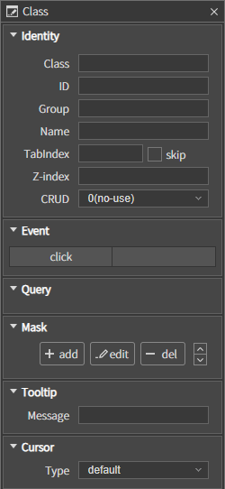
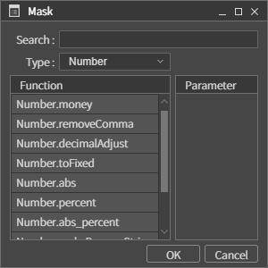
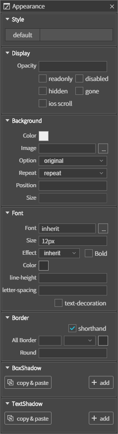

# 04. Global Properties

글로벌 속성은 각 컴포넌트에 공통적으로 사용되는 속성과 설정값을 의미합니다.  
각 컴포넌트마다 특징적인 속성은 컴포넌트 설명에서 참고하여 주십시오.

## A. Properties in Class Pane
Class Pane의 공통 속성입니다.

### Identity

컴포넌트를 구분 할 수 있는 ID 및 그룹 ID를 설정하는 속성 모음입니다.

* **Class :** 현재 컴포넌트의 클래스명을 설정하는 속성입니다. 확장 컴포넌트를 사용시 변경 할 수 있습니다.
* **ID :** 컴포넌트의 아이디를 설정하는 속성입니다. 컴포넌트 아이디는 현재 화면 뷰에서 유일해야 합니다.
* **Group :** 그룹은 컴포넌트를 그룹화하는 속성으로 그룹화하여 동일한 그룹 이름을 지정하는 속성입니다. 그룹화된 컴포넌트는 findCompByGroup(‘그룹명’) 함수를 통해 배열로 컴포넌트를 얻을 수 있습니다. 컴포넌트의 배열 순서는 레이아웃 상의 위치 순서입니다.
* **Name :** 현재 컴퍼넌트의 네임을 설정하는 속성입니다.
* **TabIndex :** 컴포넌트의 탭인덱스를 설정하는 속성입니다.
    * **skip :** 탭인덱스 순서에서 제외하는 속성입니다. 체크하게 될 경우 TabIndex 속성값을 -1로 설정합니다.
* **Z-index :** 컴포넌트의 레이어 순서 값을 설정하는 속성입니다.

### Event
컴포넌트에 이벤트를 설정하는 속성입니다.  
이벤트 리스트에서 설정하기 위한 이벤트명의 우측 블록을 더블클릭하면 Add Event 다이얼로그가 오픈됩니다.

### Query
컴포넌트에 TR통신을 위한 통신정보 파일인 Query를 바인딩하는 속성입니다.

### Mask
컴포넌트에 마스크 기능을 추가하는 속성입니다. 마스크 종류는 Number, Date, Color 계열이 있습니다.  
추가 버튼을 클릭하면 마스크를 선택하여 추가할 수 있는 다이얼로그가 오픈됩니다.

### Tooltip
컴포넌트에 툴팁을 설정하는 속성입니다. 툴팁은 마우스를 컴포넌트에 올렸을 경우 노출됩니다.

### Cursor
컴포넌트의 커서를 설정하는 속성입니다. 커서는 컴포넌트의 상태 및 기능에 따라 설정할 수 있습니다. 

## B. Properties in Appearance Pane
Appearance pane의 공통 속성입니다.

Appearance Pane은 각 컴포넌트마다 속성을 설정할 수 있는 뷰입니다. 글로벌 속성에서는 컴포넌트의 공통적인 속성만 설명합니다.

나머지 특징적 속성은 각 컴포넌트 설명에서 참고해 주십시오.

### Style

### Display

컴포넌트의 스타일 속성 및 display 상태를 설정하는 기능입니다.

* **Opacity :** 컴포넌트의 투명도를 설정하는 속성입니다. 0과 1 사이값을 입력하세요.
* **readonly :** Input 계열의 컴포넌트일 경우 읽기만 가능하게 하는 속성입니다.
* **disabled :** 컴포넌트의 비활성을 설정하는 속성입니다.
* **hidden :** 컴포넌트의 visibility를 설정하는 속성입니다. 해당 속성을 설정하면 보이지는 않지만 컴포넌트의 영역이 그대로 존재합니다.
* **gone :** 컴포넌트의 display를 설정하는 속성입니다. 해당 속성을 설정하면 hidden과 달리 컴포넌트 영역도 보여지지 않습니다.
* **ios scroll :** iOS에서 전용으로 사용하는 스크롤 옵션

### Background

컴포넌트의 배경을 설정한다.

### Font

글자의 폰트를 설정한다.

### Border

컴포넌트의 윤곽선을 설정한다.

### BoxShadow

컴포넌트의 테두리를 감싼 그림자 효과를 추가한다.

### TextShadow

컴포넌트 내부 텍스트에 그림자 효과를 추가한다.

### Transform

컴포넌트의 변형 속성을 설정합니다.

### Animation

컴포넌트에 애니메이션 효과를 설정합니다.