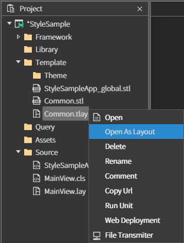
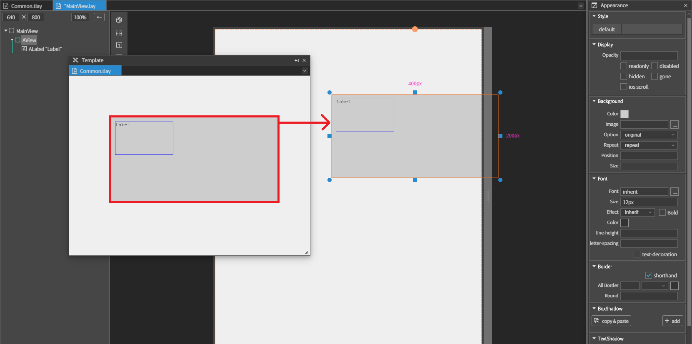

# 05. Style Template

스파이더젠에서는 CSS(Cascading Style Sheets) 를 지원하며 CSS를 이용한 다양한 컬러테마를 적성 할 수 있습니다.
또한 Style Key Mapping 체계를 지원해 재작업 없이 컬러테마를 쉽게 적용할 수 있습니다.

## A. Style Maker

Style Maker는 여러 화면 및 컴포넌트에서 사용 할 스타일을 제작하는데 사용합니다. Style Maker에서 등록한 스타일을 수정하면 등록된 모든 컴포넌트에서 한번에 수정되어 유지보수 및 컨트롤이 용이합니다.

### Make stl

Style Maker를 사용하기 위해서는 먼저 stl 파일을 생성해야 합니다.

스타일을 사용할 프로젝트를 오픈 한 후 [Project-Template]에서 마우스 오른쪽버튼을 클릭합니다. 그 후 [Add new-Style]를 선택 하면 stl파일이 생성됩니다.

<center>


</center>

생성된 stl 파일을 오픈 하면 아래와 같은 화면이 나옵니다.

<center>


</center>

Style list, Code, Tools 이렇게 총 세 구역으로 나누어집니다.

### Style list

<center>


</center>

Style list에서는 각 스타일들이 컴포넌트에 어떻게 반영되는지 간단하게 확인할 수 있으며 세부 기능은 다음과 같습니다.

- **검색  :** 상단의 텍스트를 입력하여 스타일명 또는 내용으로 검색할 수 있습니다.
- **추가  :** + 버튼을 눌러 새로운 스타일을 추가할 수 있습니다.
- **삭제  :** - 버튼을 누르거나 스타일을 우클릭 후 삭제를 선택하여 스타일을 삭제할 수 있습니다.
- **이름 변경  :** 스타일을 우클릭 하여 이름을 변경할 수 있습니다.
- **스타일 등록  :** 스타일을 드래그 하여 lay 파일의 컴포넌트에 올려놓는것으로 컴포넌트에 스타일을 등록할 수 있습니다. 컴포넌트의 Appearance의 Style 속성에 올려놓아도 등록이 가능합니다.
- **서브 스타일 확인  :** 스타일을 더블클릭 하면 서브 스타일을 확인 할 수 있으며 서브 스타일들도 드래그하여 컴포넌트에 등록할 수 있습니다. 서브스타일을 사용하려면 스타일을 선택한 후 Code 영역에 아래와 같이 기존 스타일(orgin_style) 아래에 추가로 서브스타일을 입력해주면 됩니다.

```css
.origin_style
{
    color: blue;
}

.sub_style
{
    color: red;
}
```

### Code

<center>


</center>
Code영역에서는 css 문법에 맞게 원하는 스타일을 입력하면 됩니다. 새롭게 [.클래스명] 을 입력하면 서브스타일로 추가할 수 있습니다.

### Tools

<center>


</center>

Tools영역에서는 각종 스타일을 인터페이스를 통해 추가, 수정할 수 있습니다. 추가, 수정한 스타일은 Code 영역과 Style list영역에 반영됩니다.

추가로 다음과 같은 기능들이 있습니다.

- **Code  :** Code 영역을 펼치거나 접습니다.
- **Tools  :** Tools 영역을 펼치거나 접습니다.
- **Clone  :** 현재 선택된 스타일의 제목에 _clone 을 추가하여 복사합니다.
- **Import  :** css파일을 복사하여 붙여넣으면 새로운 스타일이 자동으로 생성됩니다.
- **Save  :** 모든 수정사항을 저장합니다.

### Use Style

Style Maker를 통해서 만든 스타일은 lay파일의 컴포넌트 또는 Appearance의 Style에 직접 드래그하여 등록할 수 있습니다.

<center>


</center>
또는 Appearance의 Style을 더블클릭하여 Style Picker에서도 등록할 수 있습니다

<center>


</center>

## B. Template

Template은 자주 사용되는 컴포넌트의 조합 및 스타일의 조합 등을 미리 등록하여 쉽게 가져다 쓸 수 있도록 만들어주는 기능입니다.

### Make tlay

Template을 사용하기 위해서는 먼저 tlay 파일을 생성해야 합니다.

프로젝트를 오픈 한 후 [Project-Template]에서 마우스 오른쪽버튼을 클릭합니다. 그 후 [Add new-Template]를 선택 하면 tlay파일이 생성됩니다.

<center>


</center>

생성된 tlay 파일을 그냥 오픈하면 사용하기 위한 창이 뜨며 Template을 등록하기 위해서는 우클릭 하여 Open As Layout을 선택해야 합니다.

<center>



</center>

오픈 된 tlay 파일에서 아래와 같이 컴포넌트 조합을 만들거나 스타일을 추가할 수 있습니다.

<center>


</center>

Open As Layout으로 오픈 된 tlay 파일의 사용 방법은 기존 lay 파일과 같습니다.

### Use Template

Open As Layout으로 만든 Template은 오픈 된 lay 파일에 드래그하여 사용할 수 있습니다.

<center>



</center>
Template 창에서 lay파일로 드래그 하면 똑같은 컴포넌트가 lay 파일에 생성됩니다


