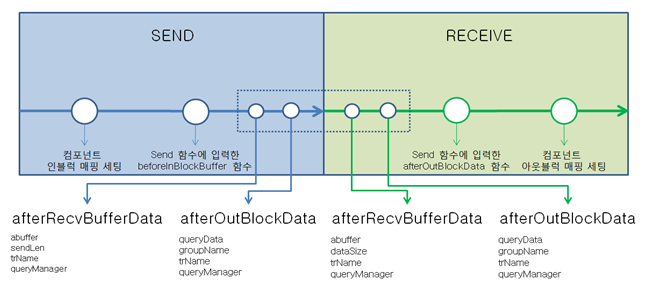
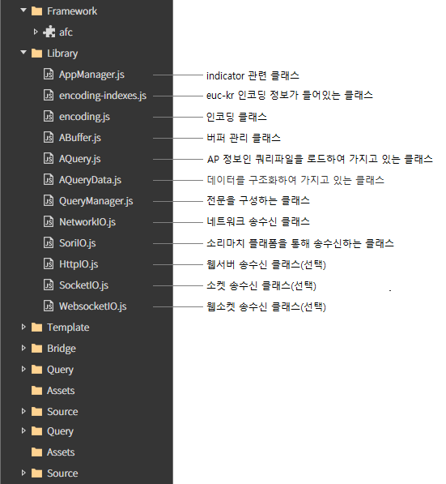
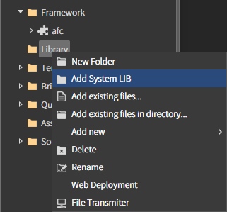
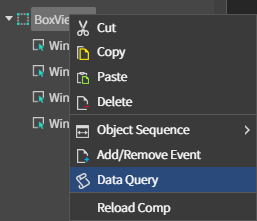
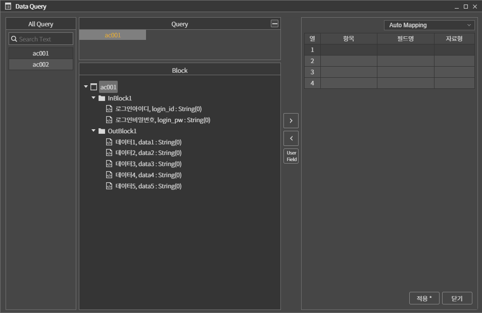
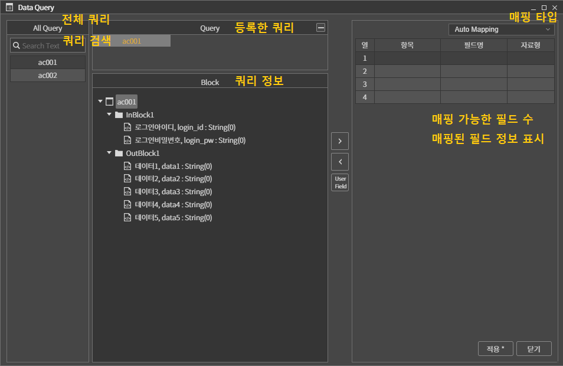
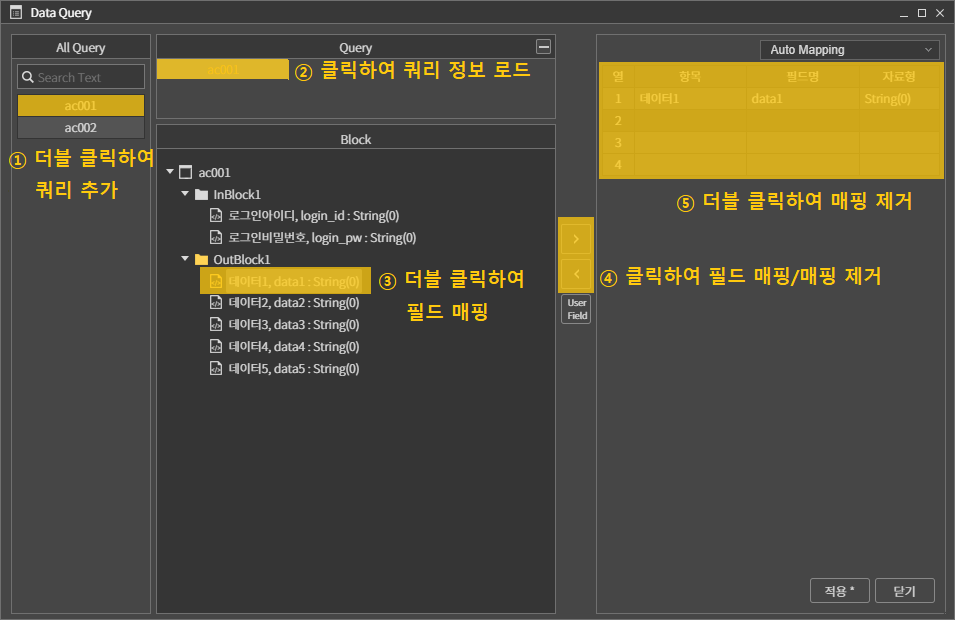
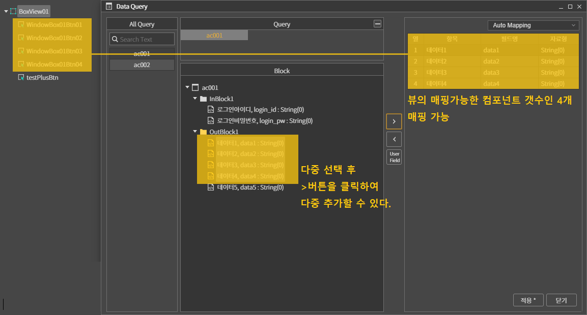
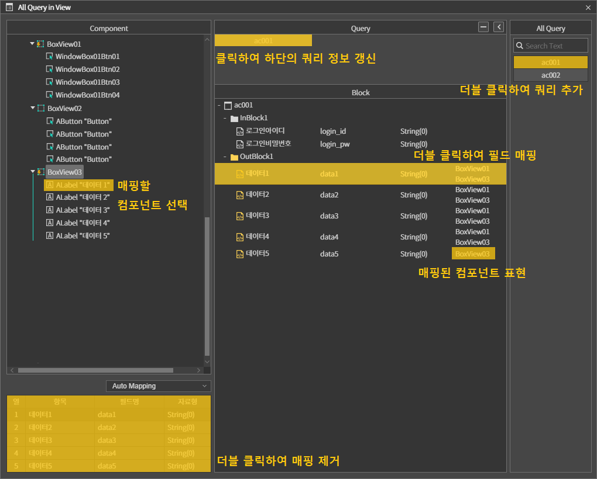

# 06. I/O 시스템


스파이더젠에서는 컴포넌트 매핑 방식의 뛰어난 I/O 시스템을 제공합니다.

<br/>

## A. I/O 데이터 입출력 순서





<br/>
<br/>

## B. Library 추가  


스파이더젠에서 I/O 통신을 위해서는 Library에 통신 관련 라이브러리를 추가해야 합니다. 




<br/>
<br/>

## C. QueryManager 객체 초기화 

1. I/O 데이터 통신을 위해서는 QueryManager 객체를 생성하고 초기화해야 합니다. 
 
2. 대부분 초기화는 각 프로젝트 Application 파일 (프로젝트명App.cls)의 onReady 메소드에 추가합니다. 


```js
 
function IoProjectApp:onReady() 
{ 
    super.onReady(); 
 
    // QueryManager 객체 초기화 
    this.queryManager = new QueryManager('info'); 
    var netIo = new WebsocketIO(this.queryManager);  
    this.queryManager.setIoManager(netIo); 
    this.queryManager.setQueryBuffer(1024*128, 1024*128, 'euc-kr', 0x20, 0x30); 
    this.queryManager.startManager(‘127.0.0.1’, 80); 
 
    // 화면 전환 관련 소스 
    this.navigator = new ANavigator(); 
    this.navigator.registerPage('Source/MainView.lay', 'MainView'); 
    this.navigator.goPage('MainView'); 
};  
 
``` 

<br/> 

**초기화 순서**

1. QueryManager 객체를 생성합니다.

2. QueryManager에서 사용할 IO 객체를 생성합니다. 

3. HttpIO: http 통신을 위한 I/O 객체 입니다. 
    - WebsocketIO: WebSocket 통신을 위한 I/O 객체 입니다. 
    - SocketIO: TCP/IP 소켓 통신을 위한 I/O 객체 입니다. 
    - QueryManager에 I/O 객체를 설정합니다. 

4. QueryBuffer 설정 

5. sendSize: 전송 버퍼 사이즈 
    - recvSize: 수신 버퍼 사이즈 
    - charSet: 문자열 인코딩 방식 
    - emptyChar: 문자 빈공간 채울 아스키 코드값 
    - emptyNumChar: 숫자 빈공간 채울 아스키 코드값 
  
6. 전송을 시작합니다.  

<br/>
<br/>


### D. AP Setting And In/Out Block Mapping 


1. 쿼리파일을 추가 합니다.
    - 프로젝트 뷰의 Query 폴더에 쿼리파일을 추가 합니다. 마우스 우측 버튼을 클릭해서 컨텍스트 메뉴를 오픈 합니다. 
    - Add existing fiels... : 선택 


     

<br/>

 
2. 매핑할 컴포넌트를 선택하고 마우스 우측 버튼 클릭으로 컨텍스트 메뉴를 오픈합니다. 
   - Data Query 메뉴를 클릭합니다. 데이터 매핑을 위한 Data Query 팝업이 오픈됩니다.      


     


    

<br/>
 
3. Data Query 팝업 정본  

     

<br/>

4. 컴포넌트 매핑 순서는 다음과 같습니다.   
 
   - 매핑하고 싶은 쿼리(여기서는 tr512) 를 더블 클릭하여 추가합니다. 
   - 추가된 쿼리를 선택하고 쿼리 정보를 갱신합니다. 
   - 원하는 필드를 더블 클릭하거나 이동 버튼을 통해서 필드를 매핑합니다. 
   - 매핑된 필드를 제거하고 싶은 경우 매핑된 위치의 항목을 더블 클릭하거나 선택후 위치버튼을 클릭해 제거합니다.  


     
    
<br/>

5. 매핑관련 참고사항 

   - 각 컴포넌트마다 매핑 가능한 개수는 정해져 있습니다. 
   - View, Layout 컴포넌트는 자식 컴포넌트의 개수 만큼 매핑이 가능합니다. 
   - 또한, 매핑 할 항목이 연속되어 있는 경우 컴포넌트도 연속되게 생성하고 다중 추가하면 편리합니다.  


      
    
<br/>
<br/>


### E. All Query in View  

현재 화면의 전체 쿼리 정보를 열람 할 수 있습니다. 매핑하는 방법은 Data Query 매핑 방법과 동일합니다. 
 
1. 메인 메뉴의 View > All Query in View 를 클릭합니다. 

2. 매핑할 컴포넌트에 쿼리를 추가하고 매핑합니다. 


      

<br/>
<br/>


### F. 전송함수  

컴포넌트에 매핑된 query정보로 데이터를 전송하는 함수 
- **sendProcessByComp**(acomp, groupName, beforeInBlockFunc, afterOutBlockFunc) 
- **sendProcessByComps**(acomps, groupName, beforeInBlockFunc, afterOutBlockFunc) 

 
**전송할 쿼리명을 직접 지정하여 데이터를 전송하는 함수**  
- **sendProcessByName**(queryName, menuNo, groupName, beforeInBlockFunc, afterOutBlockFunc); 
- **sendProcessByNames**(queryNames, menuNo, groupName, beforeInBlockFunc, afterOutBlockFunc); 

### 데이터를 전송하고 수신 후 실시간 데이터를 자동으로 등록하는 함수 
- **sendProcessWithReal**(queryName, menuNo, groupName, beforeInBlockFunc, afterOutBlockFunc, option, realCallback
)  
    - **acomp** 컴포넌트에 매핑된 쿼리정보와 containerId를 전송 정보로 사용합니다. 
    - **groupName** 그룹명이 지정된 컴포넌트만 데이터를 수신하고 싶은 경우 세팅합니다. 
    - **menuNo**  데이터를 수신할 화면번호를 지정한다. 일반적으로 containerId를 지정합니다. 
    - **beforeInBlockFunc**, **afterOutBlockFunc** 콜백함수를 파라미터로 세팅합니다. 호출 시점은 데이터 입출력 순서의 beforeInBlockBuffer, afterOutBlockData와 같습니다. 
    - **option**  실시간 등록을 위한 정보입니다.
        - { realQuery:'', keyBlock:'InBlock1', realField:'', updateType: 0 }
        - **realQuery** 실시간 쿼리명
        - **keyBlock** 실시간 등록 키가 존재하는 블락명
        - **realField** 실시간 등록 키가 존재하는 필드명
        - **updateType**  갱신타입(-1:prepend, 0:update, 1:append)
    - **realCallback**  실시간 수신시 호출되는 함수입니다.
 

**함수 사용 예제**  

 
```js
  
function SubView:onSendBtnClick(comp, info) 
{ 
    theApp.queryManager.sendProcessByName('sampleQry01', this.getContainerId(), null, 
    function(queryData) // beforeInBlockBuffer 
    { 
        var InBlock1 = queryData.getBlockData('InBlock1'); 
        InBlock1[0].inField1 = '101'; 
        // 현재 전송에 대한 헤더정보를 변경해야하는 경우 아래 코드 사용 
        // queryData.setHeaderInfo({headerKey: headerValue}); 
    }, 
    function(queryData) // afterOutBlockData 
    { 
        if(!queryData) return; 
        var OutBlock1 = queryData.getBlockData('OutBlock1'); 
        alert(OutBlock1[0].outField1); 
    }); 
};  
 
```

<br/>

**전송시 개발자 정보 변경** 
* 전송 함수의 beforeInBlockBuffer 함수내에서 queryData의 setHeaderInfo함수로 변경합니다. 
* 헤더정보를 변경해야하는 경우 사용하며, 헤더정보를 변경하지 않으면 queryManager에 세팅되어있는 헤더정보값이 기본값입니다.  

```js
 
function SubView:onSendBtnClick(comp, info) 
{ 
    theApp.queryManager.sendProcessByName('cbzs0040u0', this.getContainerId(), null, 
    function(queryData) // beforeInBlockBuffer 
    { 
        // 현재 전송에 대한 헤더정보를 변경해야하는 경우 아래 코드 사용 
        queryData.setHeaderInfo({ 
            headerKey1: headerValue1, 
            headerKey2: headerValue2 
        }); 
    }, 
    function(queryData) // afterOutBlockData 
    { 
    }); 
};   
```
 
<br/> 
<br/> 

### G. QueryListener 등록

addQueryListener 함수를 호출하는 경우 송수신이 발생할 때 위의 4가지 시점마다 매개변수로 전달한 객체의 함수가 호출됩니다.  

어떠한 송수신이 일어나더라도 호출되기 때문에 trName으로 구분을 하여 처리하는 것을권장합니다.  


```js
 
function SubView:onInitDone() 
{ 
    // QueryListener 를 등록합니다. 
    theApp.queryManageer.addQueryListener(this); 
}; 
// 전송버퍼에 데이터를 채우기 전에 호출된다, 
function SubView:beforeInBlockBuffer(abuf, sendLen, trName, queryManager){}; 
 
// 전송버퍼의 데이터를 전송하기 바로 전에 호출된다 
function SubView:beforeSendBufferData(abuf, sendLen, trName, queryManager){}; 
 
// 수신 버퍼에 데이터를 수신한 후 바로 호출된다. 
function SubView:afterRecvBufferData(abuf, sendLen, trName, queryManager){}; 
 
// 수신된 데이터를 AQueryData에 채운 후 호출된다. 
function SubView:afterOutBlockData(queryData, groupName, trName, queryManager){};  
 
```
