# 스파이더젠 시작하기

## 1. SpiderGen 다운로드
스파이더젠의 다운로드는 아래 링크에서 가능합니다.

설치하려는 특정 버전이 있지 않다면 자신의 OS에 맞는 최신버전의 파일을 다운로드 합니다.

 <a href="https://www.spidergen.org:3003/?pid=T040000" target="_blank"><strong>스파이더젠 다운로드</strong></a> 


## 2. 스파이더젠 실행 및 프로젝트 생성
스파이더젠 다운로드 후 압축을 풀고 폴더내의 SpiderGen3.exe 파일을 실행하면 가장 처음에 빈 화면이 뜹니다.

<center>

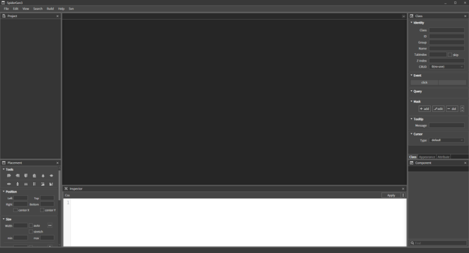

</center>

### 2.1 프로젝트 생성

상단의 메뉴 중 File > New Project…(Ctrl + Shift + N)를 선택합니다.

<center>

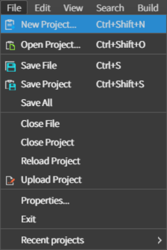

</center>

이 후 Project Name에 NewProject 혹은 원하는 이름을 입력하고 프로젝트를 생성합니다.<br> 단, 특수문자는 사용할 수 없습니다.

<center>

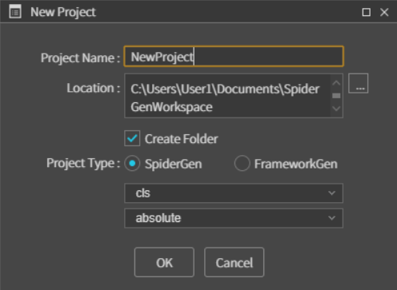

</center>

### 2.2 기본적인 사용 방법

프로젝트가 생성되면 아래와 같이 프로젝트 트리가 보입니다.

<center>

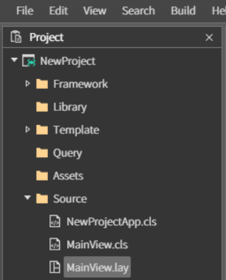

</center>

최초에 프로젝트를 생성하면 Source 폴더 안에 <strong>프로젝트이름App.cls, MainView.cls, MainView.lay</strong> 파일이 생성됩니다.

<strong>프로젝트이름App.cls</strong>는 프로젝트 실행 시 최초로 실행되는 파일입니다. <strong>MainView.cls</strong>와 <strong>MainView.lay</strong>파일은 서로 짝을 이루는 파일이며 cls파일과 lay파일은 각각 아래와 같은 특징이 있습니다.

* cls 파일

같은 이름의 lay파일과 짝을 이루며 lay파일의 컴포넌트들을 컨트롤 하거나 원하는 기능들을 사용할 수 있게 코드를 편집하는 파일입니다. 자바스크립트문법을 따르고 있습니다.

* lay 파일

같은 이름의 cls파일과 짝을 이루며 실행 시 화면에서 보일 컴포넌트들을 추가하고 모양을 만드는 파일입니다. 각 컴포넌트들의 id를 지정하여 cls파일에서 사용할 수 있습니다.


### 2.2.1 컴포넌트 추가하기

MainView.lay를 열어보면 비어있는 흰색 배경의 뷰가 보입니다. 이 위치가 작업 뷰입니다.

우측 하단의 Component 에는 스파이더젠에서 사용할 수 있는 각종 컴포넌트들이 모여 있습니다.

만약 Component가 보이지 않는다면 상단 메뉴 중 View > Component(Ctrl + 1)을 선택 하면 찾을 수 있습니다.

<center>

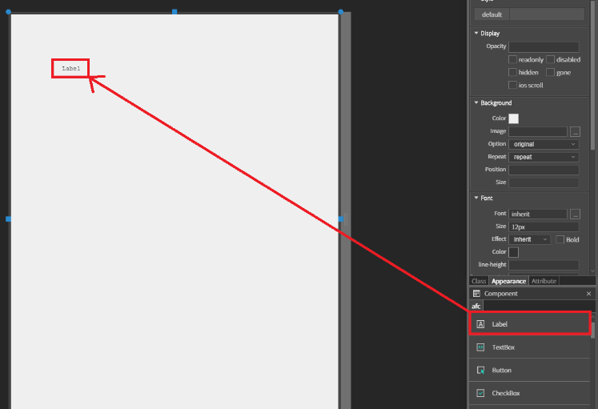

</center>


Label을 더블클릭 하거나 드래그하여 작업 뷰에 올려놓으면 새 라벨이 생성되어 작업 뷰 상에 Label이라는 글자가 보입니다.

우측의 Attribute를 선택하여 라벨의 속성을 볼 수 있습니다.

만약 Attribute가 보이지 않는다면 마찬가지로 상단 메뉴 중 View > Attribute(Ctrl + 6)를 선택하면 찾을 수 있습니다.

<center>

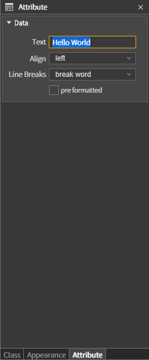

</center>

Attribute > Data > Text 에 'Hello World'를 입력합니다.

<center>

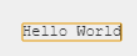

</center>

라벨을 클릭 한 상태에서 F2를 눌러서 작업 뷰 상에서 바로 수정 할 수 있습니다.

작업 뷰의 라벨이 Hello World라고 변경되었는지 확인합니다.

### 2.2.2 이벤트 만들기

이번에는 오픈되어있는 MainView.lay파일에서 Button을 추가합니다.

Label과 똑같이 Component에서 Button을 더블클릭 하거나 드래그하여 작업 뷰로 올리면 생성됩니다.

<center>

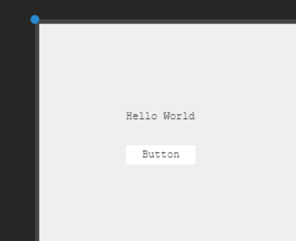

</center>

이런식으로 버튼이 추가되었다면 버튼을 누르고 우측의 Class를 선택하여 버튼의 분류와 이벤트 등을 확인 할 수 있습니다.

만약 Class가 보이지 않는다면 상단 메뉴 중 View > Class(Ctrl + 4)를 선택하면 찾을 수 있습니다.

<center>

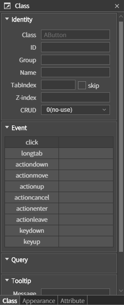

</center>

이와같이 Class를 확인하면 Event를 추가할 수 있는 그리드가 있는데, 버튼 클릭 시의 이벤트를 추가할 것이므로 click을 더블클릭하여 Add Event 창을 오픈합니다.

<center>

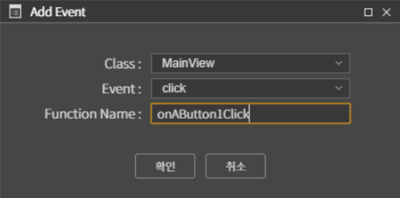

</center>


확인을 누르면 cls파일이 오픈되며 이벤트 생성 시 정한 이름의 함수가 추가됩니다.

TODO:edit here 부분에 알림창을 띄우는 함수를 추가합니다.

``` javascript
function MainView*onAButton1Click(comp, info, e)
{

    //TODO:edit here
    alert('Hello World');

};
```


## 3.빌드 및 실행

### 3.1 시뮬레이터

만들어진 프로젝트를 실행하기 위해 상단의 메뉴 중 Build > Run Project(F5)를 선택 합니다.

<center>

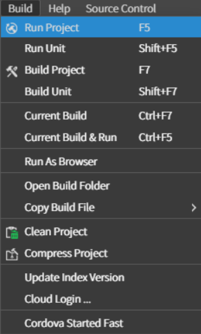

</center>

실행하여 아래와같이 보인다면 성공입니다.

<center>

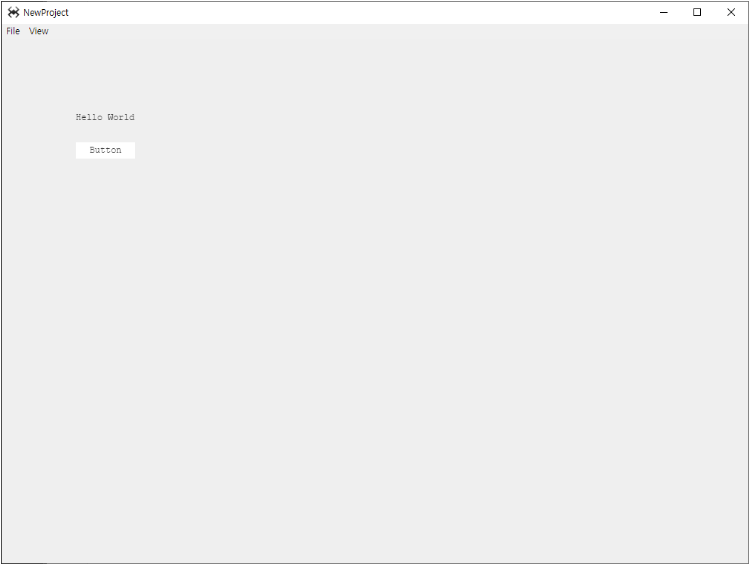

</center>

lay파일에서 만들었던 Button을 클릭합니다.

<center>

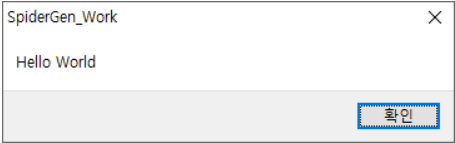

</center>

### 3.1.1 시뮬레이터 디버깅 툴

좌측 상단의 메뉴에서 View를 누르면 시뮬레이터뷰를 컨트롤할 수 있는 메뉴가 나옵니다.

<center>

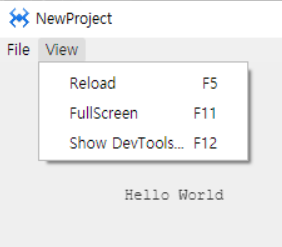

</center>

* Reload : 시뮬레이터를 새로고침 하고 스파이더젠에서 새로 빌드된 사항을 적용합니다.

* FullScreen : 시뮬레이터 창을 최대화 합니다.

* Show DevTools… : Developer Tools 를 오픈 합니다.

이 메뉴 중에서 Developer Tools에서는 각 컴포넌트의 속성과 스타일을 확인 할 수 있고 코드의 디버깅이 가능하기 때문에 프로젝트를 진행하다보면 자주 사용하게 될 툴이니 살펴봐두면 좋습니다.

<center>

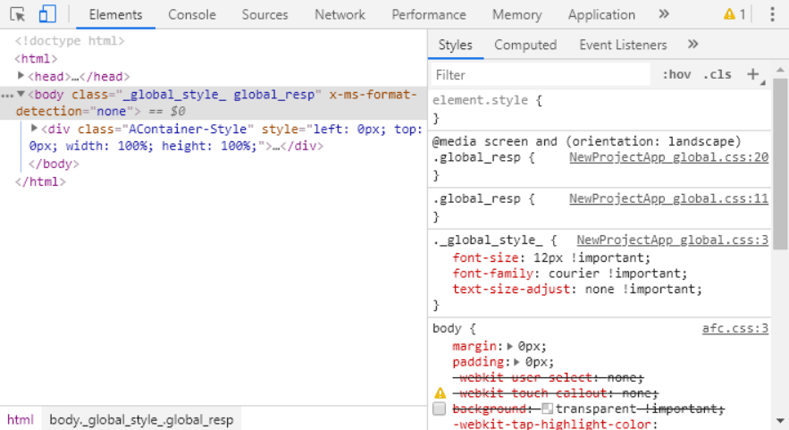

</center>

크롬 기반 개발자 툴이며 [이 곳]()에서 사용법을 확인할 수 있습니다.

### 3.2 모바일

SpiderGen 프로젝트는 하나의 소스로 안드로이드, iOS 모두에서 사용할 수 있습니다.

사용하기 위해서는 우선 Cordova를 설치하고 플랫폼을 추가해야합니다.

Cordova의 설치와 모바일 빌드는 다음 단계에서 소개합니다.

[**모바일 빌드하기**](./02._모바일에서_실행하기.html)
