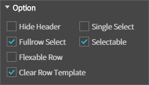
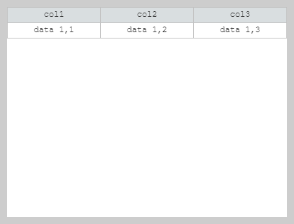
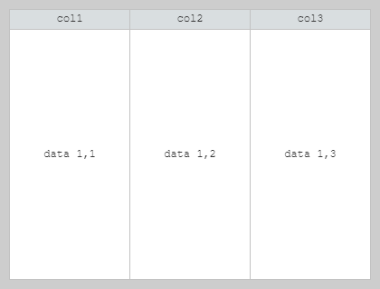
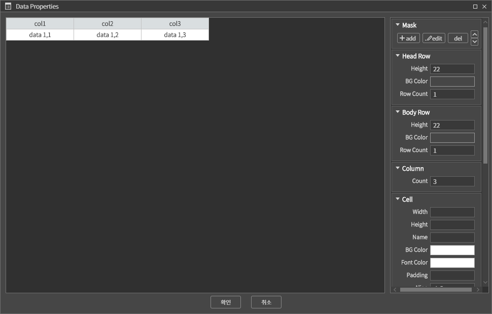
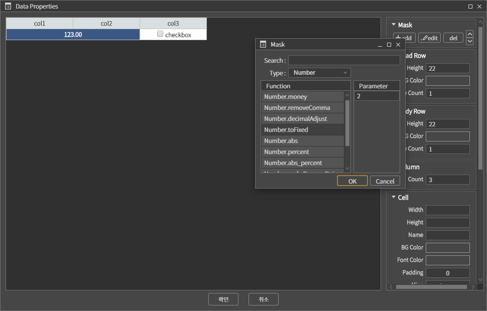
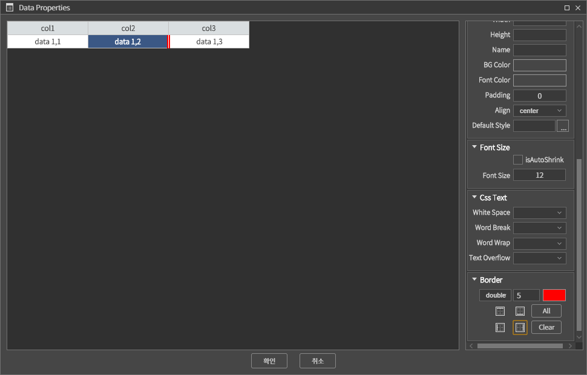
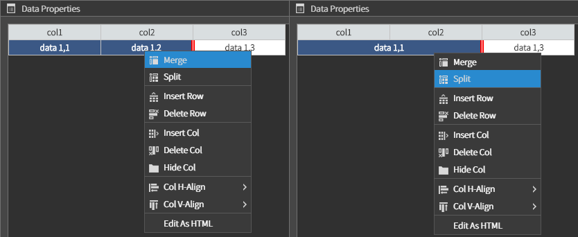
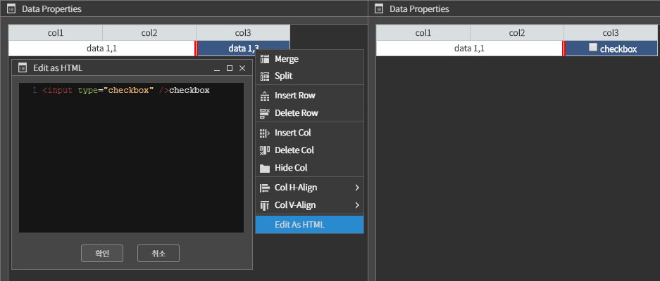

<!-- AGrid 사용 메뉴얼
 -->

# AGrid 사용 메뉴얼

[샘플 프로젝트 다운로드하기]() - 현재는 없음

## 1. 옵션 설정

그리드의 옵션에는 아래와 같은 항목들이 있다. 
<br/>Hide Header 는 헤더를 제거하는 간단한 옵션이므로 그 외의 항목에 대해 알아보자



### 1.1 로우, 셀 선택

선택과 관련된 옵션은 아래와 같은 항목들이 있다.
- Selectable : 선택가능여부
- Fullrow Select : 로우 또는 셀 선택여부
- Single Select : 단일선택여부

### 1.2. FlexibleRow 옵션

Flexible 옵션을 설정하지 않은 경우에는 지정한 로우 또는 셀의 높이에 맞게 표현된다.



Flexible 옵션을 설정한 경우에는 아래 그림처럼 헤더를 제외한 바디 영역을 모든 로우가 동일하게 차지한다. 



단, 특정 셀에 필요한 높이가 최소 높이가 작은 경우 동일한 높이로 표현되지 않는다.
<br/>보통 테이블 형태의 데이터를 보여줄 때 clearRowTemplate 옵션과 같이 사용된다.
<br/>(Flexible 상태에서 로우의 개수를 많이 추가하거나 특정 셀의 font-size를 변경하여 그리드가 어떻게 표현되는지 확인해보자)

### 1.3. clearRowTemplate 옵션

그리드 초기화 후 Template 로우의 제거 여부를 정한다.

## 2. DataProperties 팝업

그리드를 더블 클릭하거나 우측클릭 후 [Data Properties] 를 선택하면 그리드의 로우, 셀을 변경할 수 있는 팝업창을 볼 수 있다.



### 2.1 헤더, 바디로우 변경하기

높이, 배경색, 로우개수를 지정할 수 있다.

### 2.2. 컬럼개수 설정, 컬럼 숨김처리

원하는 컬럼의 개수를 지정할 수 있다.

컬럼을 숨기고 싶은 경우에는 팝업의 그리드에서 숨길 위치의 셀을 선택하고 오른쪽 클릭 - [Hide Col] 선택하면 된다. 숨긴 컬럼을 다시 보임처리를 하려면 숨긴 컬럼이 위치한 좌측, 우측의 컬럼에서 오른쪽 클릭 - [Show NextCol] 또는 [Show PrevCol] 을 선택한다.

### 2.3 셀 변경하기

#### 2.3.1 마스크 지정하기
그리드에 데이터를 세팅할 때 데이터를 가공하여 표현하기 위해서 마스크를 설정한다. 마스크 설정은 셀을 먼저 선택하고 add 버튼을 클릭하여 원하는 마스크와 파라미터를 입력하고 OK 버튼을 누르면 된다.
<br/>참조 - [마스크 생성하기](./) (현재 없음)



#### 2.3.2 테두리
테두리 설정은 우측하단의 Border 항목에서 할 수 있다.


 - 테두리를 설정할 셀을 선택한다.
 - 테두리 타입, 두께, 색상을 지정한다.
 - 하단의 상, 하, 좌, 우 버튼을 눌러 특정 방향의 테두리를 지정하거나 All 버튼을 눌러 모든 방향의 테두리를 지정한다. 테두리를 없애려면 두께를 0 으로 지정하여 방향을 선택한다.
 - 초기화를 하려면 Clear 버튼을 클릭한다.

#### 2.3.3 그 외 스타일
그 외에 셀의 넓이, 높이 등을 변경할 수도 있는데 현재 변경 가능한 항목은 다음과 같다.
 - Cell - 넓이, 높이, 이름, 배경색, 글자색, 여백, 정렬, 스타일 지정
 - Font Size - 글자크기, 글자 자동 축소
 - Css Text - 줄바꿈여부, 줄바꿈시 단어유지 여부, 글자가 영역을 넘어갈 때의 처리

#### 2.3.4 병합, 해제

그리드의 셀 영역을 병합하기 위해서는 Ctrl, Shift 키를 눌러 연속된 셀 2개 이상을 선택한 뒤 마우스 오른쪽 클릭하여 [Merge] 메뉴를 선택한다. 병합된 셀을 선택하여 오른쪽 클릭하여 [Split] 메뉴를 선택하면 병합이 해제된다.




#### 2.3.5 Edit As HTML

셀 안에 HTML 태그를 넣기 위해서는 셀을 선택하고 마우스 오른쪽 클릭하여 [Edit As HTML] 메뉴를 선택한뒤 나오는 팝업에 원하는 태그를 넣고 확인버튼을 누르면 된다. 자주 쓰이는 태그에는 버튼, 체크박스, 라디오버튼이 있다.



```html
<button style="width:100px; height: 50px;" onClick="alert('test click');">
<!--
<button onClick="$(this).parents('.AGrid-Style')[0].acomp.getRootView().onCellButtonClick(this.parentElement);">
 -->
<!-- 위의 태그는 개발 중에 누르면 에러가 날 수 있음
onCellButtonClick(cell) 함수를 그리드를 추가한 뷰 cls에 작성해놓아야 한다.  -->
버튼 테스트
</button>
<input type="checkbox" />checkbox
<input type="radio" />radio
 ```

체크된 체크박스 또는 라디오의 셀 위치를 알고 싶은 경우는 아래처럼 호출하면 된다.
```js
var $checkedCbx = this.grid.$ele.find('input:checkbox:checked'),
//  $checkedRadio = this.grid.$ele.find('input:radio:checked'),
    cellIndex, thisObj = this;
$checkedCbx.each(function(index, element)
{
    //element 는 input:checkbox 이므로 부모인 셀(td)로 위치를 찾는다.
    cellIndex = thisObj.grid.indexOfCell(element.parentElement);
    console.log(cellIndex);
});
 ```

