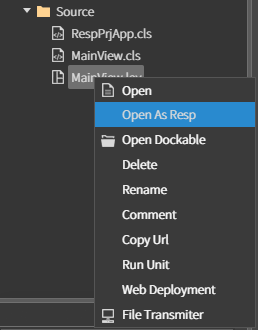
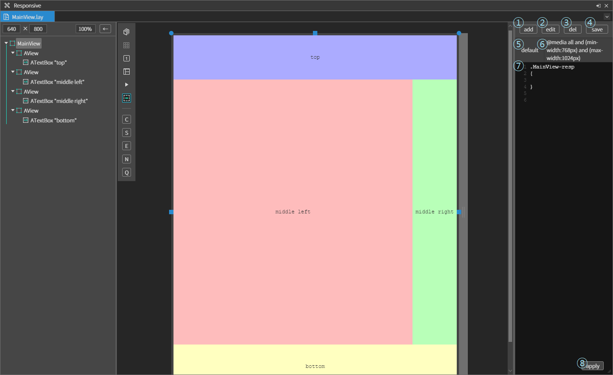
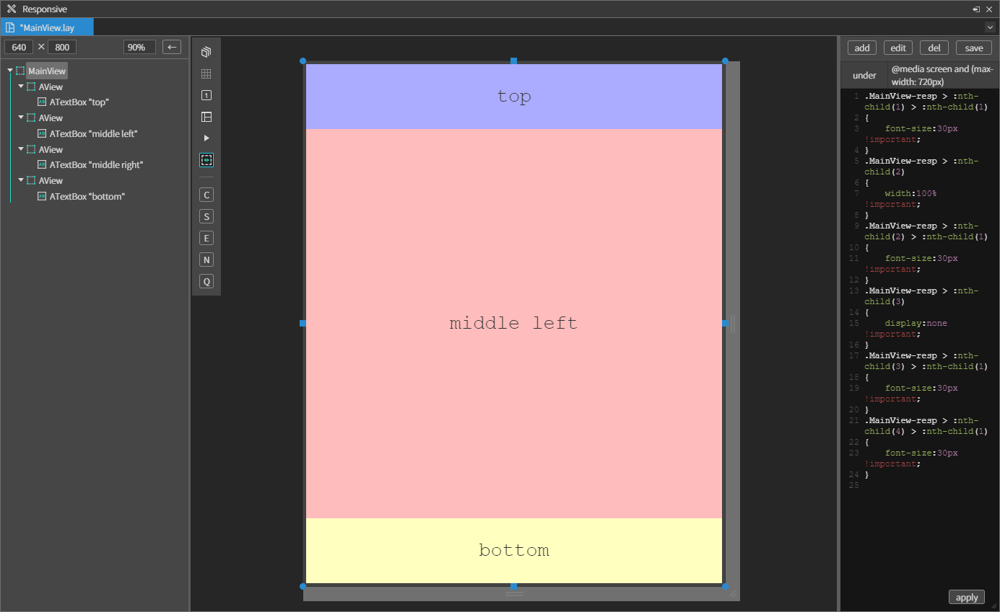
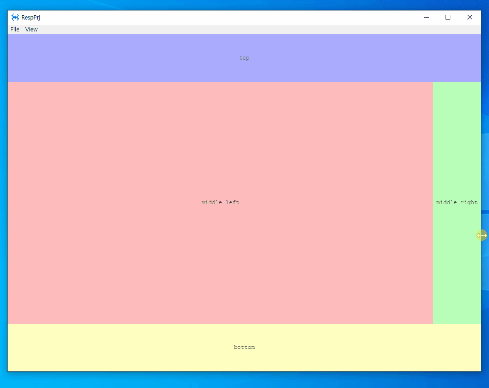

# 반응형

<!-- [샘플 프로젝트 다운로드하기]() - 현재는 없음 -->

스파이더젠에서 화면을 반응형으로 개발하는 방법에는 여러가지 방법이 있다. 그 중 3가지를 소개한다.
1. 확장자가 stl 인 파일을 오픈하여 직접 @media 내용을 작성하여 처리하는 방법
2. 각 화면을 Responsive 뷰를 사용하여 변경하는 방법
3. 디바이스가 MOBILE/PC 에 따라 다른 화면을 로드하는 방법

## 1. Media Query 작성하기

Media Query 를 작성하는 것은 컴포넌트에 직접 스타일을 적용하는 것이 아니라 CSS 를 적용하여 사용할 때 유용하다. 원하는 미디어 유형을 정하고 원하는 CSS 내용을 작성하면 된다.

```css
.top
{
  background-color: red;
}
.bottom
{
  background-color: blue;
}
@media screen and (max-width: 720px)
{
  .top
  {
    background-color: blue;
  }
  .bottom
  {
    background-color: red;
  }
}

```

## 2. Responsive 뷰를 사용하여 변경

### 2.1 반응형 처리하기

각각 화면을 반응형으로 설정하려면 변경하고 싶은 화면 파일의 오른쪽 클릭하여 [Open As Resp] 메뉴를 선택한다.



오픈된 Responsive 뷰는 대부분 lay 파일을 수정할 때와 동일하지만 우측에 반응형 처리관련 영역이 있다. 각 번호에 대한 설명은 아래와 같다.
1. add 버튼 : 미디어쿼리를 추가한다.
2. edit 버튼 : 선택된 미디어쿼리를 수정한다.
3. del 버튼 : 선택된 미디어쿼리를 삭제한다.
4. save 버튼 : 수정한 lay 파일에 대한 반응형 관련 정보를 저장한다.
5. 추가한 미디어쿼리의 닉네임
6. 추가한 미디어쿼리의 내용
7. 현재 선택된 미디어쿼리에 대한 내용이 표현되며 직접 수정이 가능하다.
8. apply 버튼 : 직접 수정한 내용을 화면에 적용할 때 사용한다.



아래의 화면은 수정하여 처리한 결과이다. 변경한 내용은
1. edit 버튼으로 기본 추가된 미디어쿼리의 유형을 변경
2. 메인뷰의 글자 크기 변경
3. middle left 영역의 넓이를 100% 로 변경, middle right 영역의 뷰를 숨김처리
4. save 버튼 클릭하여 적용



### 2.2 실행화면



<!-- 
## 3. MOBILE/PC 디바이스별 화면 로드 -->