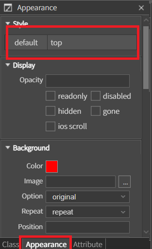
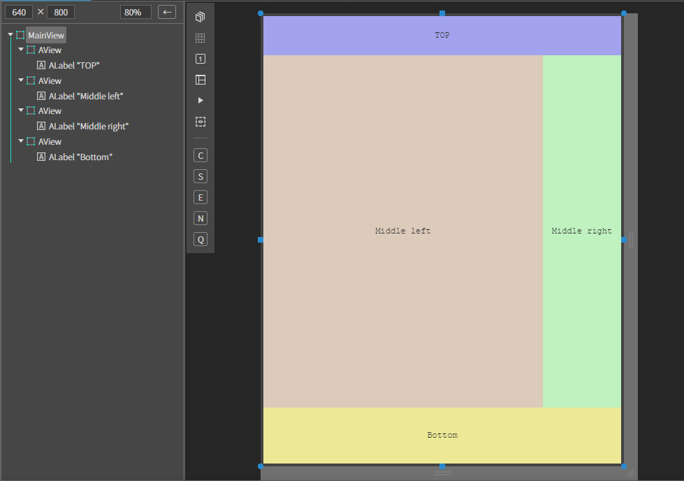
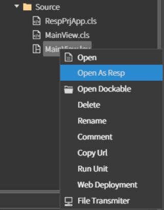
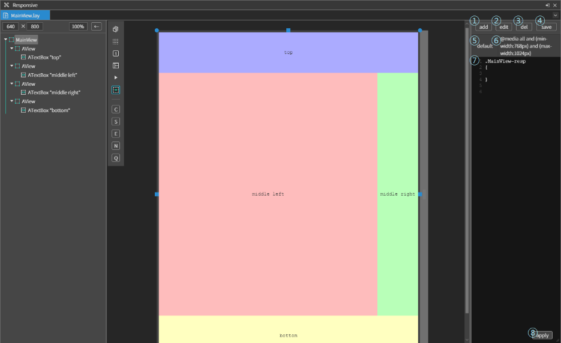
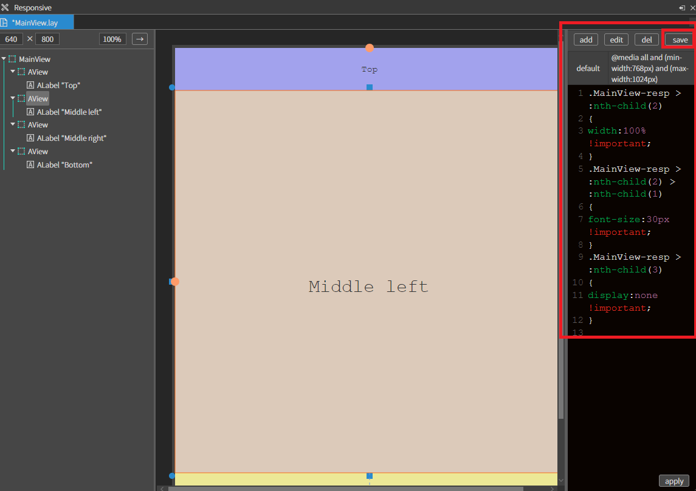
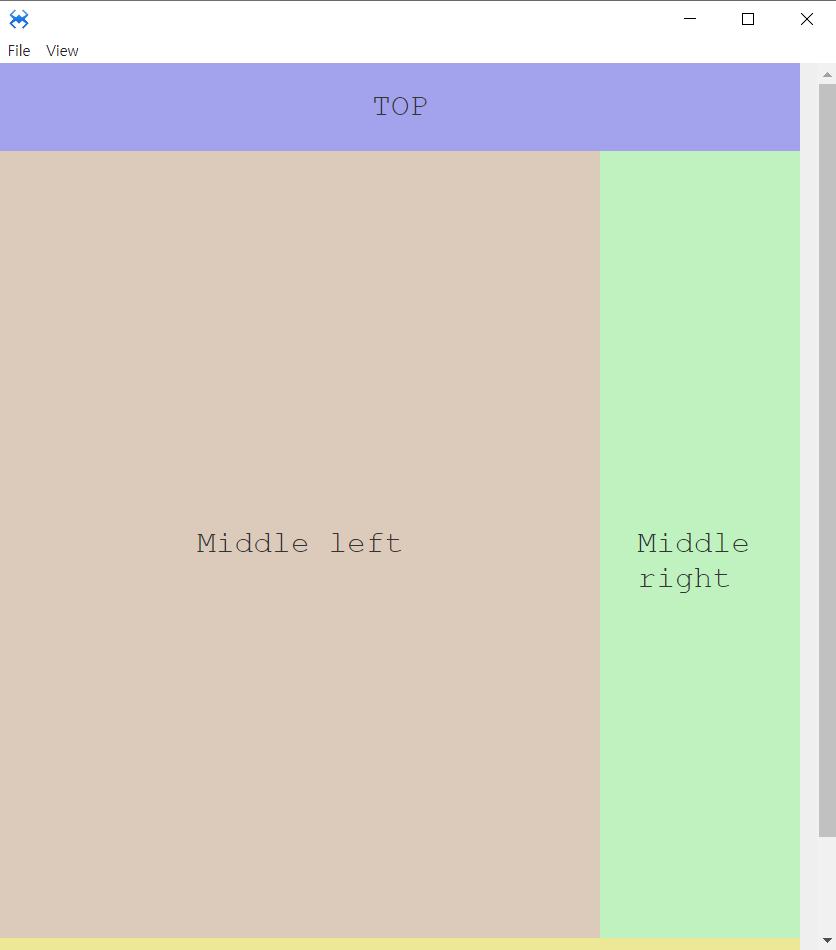

#  반응형

스파이더젠에서 화면을 반응형으로 개발하는 방법에는 여러가지 방법이 있습니다. 그 중 2가지를 소개합니다.

1. 확장자가 stl 인 파일을 오픈하여 직접 @media 내용을 작성하여 처리하는 방법

2. 각 화면을 Responsive 뷰를 사용하여 변경하는 방법


## 1. Media Query 작성하기

Media Query 를 작성하는 것은 컴포넌트에 직접 스타일을 적용하는 것이 아니라 CSS 를 적용하여 사용할 때 유용합니다. 원하는 미디어 유형을 정하고 원하는 CSS 내용을 작성하면 됩니다.

stl 파일을 생성한 뒤 아래와 같이 스타일을 추가하여 코드를 수정해 줍니다.

<center>


</center>

``` javascript
.top
{
  background-color: red;
}
@media screen and (max-width: 720px)
{
  .top
  {
    background-color: blue;
  }
}
```

```javascript
.bottom
{
  background-color: blue;
}

@media screen and (max-width: 720px)
{
  .bottom
  {
    background-color: red;
  }
}
```
Appearance 에서 style을 적용시켜줍니다.
<center>



</center>

 F5를 누르거나 Run 을 눌러 시뮬레이터를 실행하고 가로 넓이를 늘렸다 줄였다 하며 Width에 따라 스타일이 변경되는 것을 확인합니다. 

<center>


</center>

## 2.Responsive 뷰를 사용하여 변경

### 2.1 반응형 처리하기

 아래 정보를 참고하여 컴포넌트를 배치합니다.

<center>



</center>

|Comp|text|position|size|Background-color|
|----|----|--------|----|----------------|
|MainView||||
|AView||left : 0px top : 0px|width : 100%, Height : 70px|rgba(92, 92, 235, 0.52)|
|ALabel|Top|center X, center Y |width : auto , Height : auto|
|AView||left : 0px, top: 70px|width : 500px , H-stretch 100px|rgba(209, 181, 156, 0.64)|
|ALabel|Middle left|center X, center Y|width : auto , Height : auto|
|AView||right :0px, top: 70px	|width : 140px , H-stretch 100px|rgba(150, 244, 150, 0.54)|
|ALabel|Middle right|center X, center Y|width : auto , Height : auto|
|AView||left :0px, Bottom: 0px	| width :100%, Height : 100px|rgba(235, 228, 108, 0.68)|
|ALabel|Bottom|center X, center Y|width : auto , Height : auto|


각각 화면을 반응형으로 설정하려면 변경하고 싶은 화면 파일의 오른쪽 클릭하여 [Open As Resp] 메뉴를 선택합니다.

<center>



</center>

오픈된 Responsive 뷰는 대부분 lay 파일을 수정할 때와 동일하지만 우측에 반응형 처리관련 영역이 있습니다. 각 번호에 대한 설명은 아래와 같습니다.

1. add 버튼 : 미디어쿼리를 추가한다.
2. edit 버튼 : 선택된 미디어쿼리를 수정한다.
3. del 버튼 : 선택된 미디어쿼리를 삭제한다.
4. save 버튼 : 수정한 lay 파일에 대한 반응형 관련 정보를 저장한다.
5. 추가한 미디어쿼리의 닉네임
6. 추가한 미디어쿼리의 내용
7. 현재 선택된 미디어쿼리에 대한 내용이 표현되며 직접 수정이 가능하다.
8. apply 버튼 : 직접 수정한 내용을 화면에 적용할 때 사용한다.

<center>



</center>

아래의 화면은 수정하여 처리한 결과입니다. 변경한 내용은

1. middle left 영역의 넓이를 100% 로 변경, middle right 영역의 뷰를 숨김처리
2. middle left 글자 크기 변경
3. save 버튼 클릭하여 적용

<center>



</center>

```js
.MainView-resp > :nth-child(2) // :nth-child(N)= 부모안에 모든 요소 중 N번째 요소
{
	width:100% !important;
}
.MainView-resp > :nth-child(2) > :nth-child(1)
{
	left:220px !important;
	font-size:30px !important;
}
.MainView-resp > :nth-child(3)
{
	display:none !important;
}

```

 F5를 누르거나 Run 을 눌러 시뮬레이터를 실행하고 가로 넓이를 늘렸다 줄였다 하며 Width에 따라 스타일이 변경되는 것을 확인합니다. 

<center>



</center>