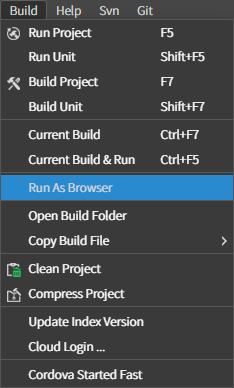
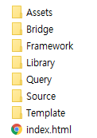
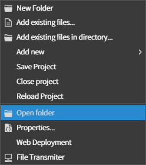
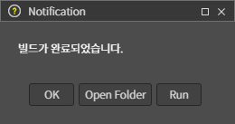

# Run As Web

스파이더젠 프로젝트를 웹에서 띄우는 방법을 알아본다.

## 1. 자동 실행

스파이더젠에서 프로젝트를 오픈 하고 [Build-Run AsBrowser]를 선택 하면 자동으로 생성되어진 로컬서버에 빌드 된 프로젝트가 옮겨지고 바로 웹에서 확인할 수 있게 된다.

## 2. 수동 실행

만약 사용중인 웹서버가 있다면 프로젝트 빌드 후에 생성되는 bin 폴더 내부의 index.html을 포함한 생성된 모든 폴더 및 파일들을 웹서버에 복사하거나 옮겨서 사용할 수 있다.

bin 폴더가 존재하는 프로젝트 폴더는 스파이더젠에서 프로젝트 루트폴더를 우클릭 하여 아래와 같이 오픈 하거나 빌드 후에 Open Folder를 클릭하여 오픈 할 수 있다.

