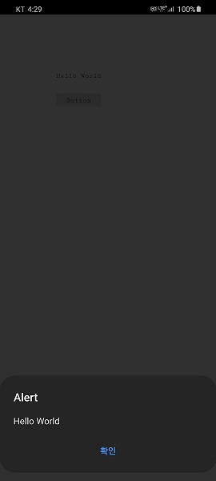

# 네이티브에서 실행하기

## 1. 다운로드 및 설치

네이티브에서 실행하기에 앞서 Cordova 설치하고 플랫폼에 추가해야하며, 더 심화적인 사용을 위해서는 해당 네이티브의 개발툴 설치를 권장한다.

* <a href="https://developer.android.com/studio" target="_blank"><strong>Android Studio</strong></a>
* <a href="https://apps.apple.com/kr/app/xcode/id497799835" target="_blank"><strong>Xcode</strong></a>

### 1.1 Cordova 설치

스파이더젠 프로젝트를 오픈한 상태에서 Build > Cordova Started Fast를 선택하면 Cordova를 설치 하고 플랫폼을 추가할 수 있는 창이 나타난다.


Cordova가 설치되어있지 않은 상태라면 아래와같이 설치하는 알림창이 뜨는데, 예를 눌러 Cordova를 설치한다.


설치가 된 후 Cordova Started Fast창 내의 Create cordova project를 누르면 해당 프로젝트폴더 내에 Cordova 폴더가 생성되는것을 확인할 수 있다. 이 폴더의 위치는 변경되어서는 안된다.


## 2. Android에서 실행

Cordova Started Fast 창의 Select Platform에서 android를 선택한 후 Add a platform 버튼을 누르면 현재 프로젝트의 Cordova 내부에 Android 플랫폼이 추가된다.

이 후 스파이더젠에서 바로 실행을 하려면 Build & Run 을 누르면 되지만, 먼저 <a href="https://www.oracle.com/java/technologies/javase/javase-jdk8-downloads.html" target="_blank"><strong>javac(JDK)</strong></a>와 <a href="https://gradle.org/releases/" target="_blank"><strong>gradle</strong></a>의 설치 및 환경변수 세팅이 되어있어야 한다. 설치 후에는 스파이더젠을 재실행 해야한다.

이 과정은 굳이 거치지 않고 <a href="https://developer.android.com/studio" target="_blank"><strong>Android Studio</strong></a>를 통해서도 실행이 가능하다.

아래는 안드로이드 기기에서 실행하여 미리 만들어둔 버튼을 클릭하여 알림창을 띄운 화면이다.



### 2.1 Android Studio

안드로이드 스튜디오에서 실행하기 위해서는 먼저 <a href="https://developer.android.com/studio" target="_blank"><strong>이 곳</strong></a>에서 설치를 해야한다.

설치 후 Android Studio 실행 후 [File > Open]을 선택하여 스파이더젠 프로젝트에서 생성한 cordova폴더의 안드로이드 프로젝트를 오픈한다. 경로는 다음과 같다.

```
[스파이더젠 프로젝트 경로]\cordova\[프로젝트명]\platforms\android
```

## 3. iOS에서 실행

iOS에서 실행하기 위해서는 macOS 환경이 있어야 한다.

Cordova Started Fast 창의 Select Platform에서 ios를 선택한 후 Add a platform 버튼을 누르면 현재 프로젝트의 Cordova 내부에 ios 플랫폼이 추가된다.

이 후 스파이더젠에서 바로 실행을 하려면 Build & Run 을 누르면 된다.

이 과정은 굳이 거치지 않고 <a href="https://apps.apple.com/kr/app/xcode/id497799835" target="_blank"><strong>XCode</strong></a>를 통해서도 실행이 가능하다.

### 3.1 XCode

XCode에서 실행하기 위해서는 먼저 <a href="https://apps.apple.com/kr/app/xcode/id497799835" target="_blank"><strong>이 곳</strong></a>에서 설치를 해야한다.

설치 후 XCode 실행 후 [File > Open]을 선택하여 스파이더젠 프로젝트에서 생성한 cordova폴더의 prj파일을 오픈한다. 경로는 다음과 같다.

```
[스파이더젠 프로젝트 경로]\cordova\[프로젝트명]\platforms\ios\[프로젝트명.xcodeproj]\project.pbxproj
```

## 4. 플러그인

프로젝트를 진행하다보면 스파이더젠으로 만들어진 HTML만으로는 불가능한 네이티브의 기능이 필요할 때가 있다. 기기의 진동이나 벨소리 울리기, 앱 이름, 버전, 기기의 모델명 등은 네이티브에서만 실행이 가능하다.

스파이더젠 프로젝트와 네이티브 프로젝트를 이어주는 브릿지 역할을 하는게 플러그인이다. 스파이더젠에서 cordova의 함수를 통해 네이티브로 요청을 하면 네이티브에서 받은 요청에 따라 수행하고 다시 스파이더젠 프로젝트 쪽으로 리턴값을 전달한다.

네이티브에서 어떤 작업을 수행할것인지에 따라 직접 플러그인을 생성할 수 있다.

### 4.1 사용법

#### 4.1.1 스파이더젠

먼저, 스파이더젠 프로젝트에서 버튼을 클릭하는 이벤트함수에 아래와 같이 작성한다.

```javascript
function MainView*onAButton1Click(comp, info, e)
{
	cordova.exec( function(result)
	{
		alert(result);
	}, null, "SpidergenPlugin", "sampleMethod", ["PluginTest"]);
};
```

cordova.exec 함수가 cordova를 통해 네이티브로 기능을 요청하는 함수이다.

cordov.exec의 각 파라미터는 다음과 같다.

```javascript
cordova.exec(<성공 시 함수>, <실패 시 함수>, <플러그인 이름>, <행동 이름>, [<인수>]);
```

#### 4.1.2 Android

Android Studio를 실행해여 스파이더젠 프로젝트에서 생성한 cordova폴더의 안드로이드 프로젝트를 오픈한다.

프로젝트가 오픈되면 SpidergenPlugin 파일을 오픈한다.


아래와 같이 기본플러그인으로 screenOrientation과 sampleMethod가 작성되어있는 코드가 보인다.

```java
    @Override
    public boolean execute(String action, JSONArray args, CallbackContext callbackContext) throws JSONException {
        if (action.equals("screenOrientation")) {
            return routeScreenOrientation(args, callbackContext);
        }
        else if (action.equals("sampleMethod")) {
            String message = args.getString(0);
            this.sampleMethod(message, callbackContext);
            return true;
        }
        return false;
    }
```

screenOrientation은 화면의 방향을 정하는 플러그인이고 sampleMethod는 말그대로 샘플 플러그인이다.

스파이더젠에서 sampleMethod을 요청했으므로 action이 sampleMethod인 곳 내부가  실행된다.

내부에서는 args로 부터 message를 받아오고 sampleMethod함수를 실행한다. args에는 스파이더젠에서 배열로 보냈던 인수가 차례대로 저장되어있어 get() 함수를 사용하여 원하는 위치의 인수를 얻어올 수 있다.

sampleMethod함수를 확인해보자.

```java
private void sampleMethod(String message, CallbackContext callbackContext) {
    if (message != null && message.length() > 0) {
        callbackContext.success(message);
    } else {
        callbackContext.error("Expected one non-empty string argument.");
    }
}
```

실행되는 함수 내부를 보면 단순하게 콜백 함수를 실행해주는 내용을 확인할 수 있다.

```java
//성공 시
callbackContext.success(message);
//실패 시
callbackContext.error("Expected one non-empty string argument.");
```

이 함수를 사용하여 받은 message를 다시 스파이더젠으로 리턴해주었다.

처음에 스파이더젠프로젝트에서 작성했던 콜백함수가 호출되어 alert으로 message가 뜨게 될것이다.

플러그인을 추가하기 원한다면 sampleMethod 아래에 새로운 else if 문을 사용하여 원하는 이름을 만들고 스파이더젠에서 cordova.exec를 통해 새로 만든 이름으로 호출해주면 된다.

#### 4.1.3 iOS

XCode를 실행해여 스파이더젠 프로젝트에서 생성한 cordova폴더의 iOS 프로젝트를 오픈한다.

프로젝트가 오픈되면 SpidergenPlugin 파일을 오픈한다.

아래와 같이 기본플러그인으로 screenOrientation과 sampleMethod가 작성되어있는 코드가 보인다.

```C
    - (void) sampleMethod:(CDVInvokedUrlCommand *)command
    {
         CDVPluginResult* pluginResult = nil;
        NSString* message = [command.arguments objectAtIndex:0];
        if (message != nil) {
                pluginResult = [CDVPluginResult resultWithStatus:CDVCommandStatus_OK messageAsString:message];
            } else {
                pluginResult = [CDVPluginResult resultWithStatus:CDVCommandStatus_ERROR messageAsString:@"Arg was null"];
            }
        [self.commandDelegate sendPluginResult:pluginResult callbackId:command.callbackId];
    }
```

screenOrientation은 화면의 방향을 정하는 플러그인이고 sampleMethod는 말그대로 샘플 플러그인이다.

스파이더젠에서 sampleMethod을 요청했으므로 sampleMethod 함수가  실행된다.

내부에서는 command.arguments로 부터 message를 받아오고 sampleMethod함수를 실행한다. command.arguments에는 스파이더젠에서 배열로 보냈던 인수가 차례대로 저장되어있어 objectAtIndex 함수를 사용하여 원하는 위치의 인수를 얻어올 수 있다.

그 후에는 단순하게 콜백 함수를 실행해주는 내용을 확인할 수 있다.

```C
//성공 시
pluginResult = [CDVPluginResult resultWithStatus:CDVCommandStatus_OK messageAsString:message];
//실패 시
pluginResult = [CDVPluginResult resultWithStatus:CDVCommandStatus_ERROR messageAsString:@"Arg was null"];
```

이 함수를 사용하여 받은 message를 다시 스파이더젠으로 리턴해주었다.

처음에 스파이더젠프로젝트에서 작성했던 콜백함수가 호출되어 alert으로 message가 뜨게 될것이다.

플러그인을 추가하기 원한다면 sampleMethod 아래에 새로운 함수를 추가하여 원하는 이름을 만들고 스파이더젠에서 cordova.exec를 통해 새로 만든 이름으로 호출해주면 된다.

### 4.2 참고자료

* <a href="https://cordova.apache.org/docs/en/latest/guide/hybrid/plugins/#the-javascript-interface" target="_blank"><strong>Plugin Development Guide</strong></a>

* <a href="https://cordova.apache.org/docs/en/latest/guide/platforms/android/plugin.html" target="_blank"><strong>Android Plugin Development Guide</strong></a>
* <a href="https://cordova.apache.org/docs/en/latest/guide/platforms/ios/plugin.html" target="_blank"><strong>iOS Plugin Development Guide</strong></a>

<!-- 자동으로 추가되도록 수정한다고 함.

 안정적인 사용을 위해 아래 코드를 추가 한다.

```java
import android.os.Build;
import android.os.Bundle;
import android.webkit.WebSettings;
import android.webkit.WebView;

import org.apache.cordova.*;

public class MainActivity extends CordovaActivity
{
    private WebView webView = null;

    @Override
    public void onCreate(Bundle savedInstanceState)
    {
        super.onCreate(savedInstanceState);
        init();

        // enable Cordova apps to be started in the background
        Bundle extras = getIntent().getExtras();
        if (extras != null && extras.getBoolean("cdvStartInBackground", false)) {
            moveTaskToBack(true);
        }

        this.webView = (WebView) this.appView.getView();
        WebSettings settings = webView.getSettings();
        if (Build.VERSION.SDK_INT > Build.VERSION_CODES.ICE_CREAM_SANDWICH)
            settings.setTextZoom(100);
        //meta 태그의 스케일을 위해 다음 두 코드는 반드시 필요한다.

        //웹뷰가 html viewport 메타 태그를 지원하게 한다.
        settings.setUseWideViewPort(true);
        //웹뷰가 html 컨텐츠가 웹뷰보다 클 경우 스크린 크기에 맞게 조정되도록 한다.
        settings.setLoadWithOverviewMode(true);

        loadUrl(launchUrl);
    }
}
``` -->