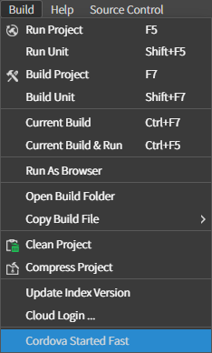
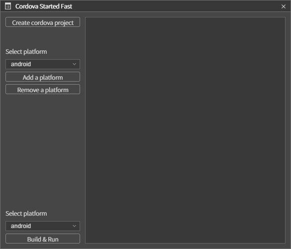

# 네이티브에서 실행하기

## 1. 다운로드 및 설치

네이티브에서 실행하기에 앞서 Cordova 설치하고 플랫폼에 추가해야하며, 더 심화적 사용을 위해서는 해당 네이티브의 개발툴 설치를 권장한다.

* [**Android Studio**](https://developer.android.com/studio)
* [**Xcode**](https://apps.apple.com/kr/app/xcode/id497799835)

### 1.1 Cordova 설치

스파이더젠 프로젝트를 오픈한 상태에서 Build > Cordova Started Fast를 선택하면 Cordova를 설치 하고 플랫폼을 추가할 수 있는 창이 나타난다.



Cordova Started Fast창 내의 Create cordova project를 누르면 해당 프로젝트폴더 내에 Cordova 폴더가 생성된다. 이 폴더의 위치는 변경되어서는 안된다.



#### 3.2.2 안드로이드에서 실행

Cordova Started Fast 창의 Select Platform에서 android를 선택한 후 Add a platform 버튼을 누르면 현재 프로젝트의 Cordova 내부에 Android 플랫폼이 추가된다.

이 후 스파이더젠에서 바로 실행을 하려면 Build & Run 을 누르면 되지만, 먼저 [**javac(JDK)**](https://www.oracle.com/java/technologies/javase/javase-jdk8-downloads.html)와 [**gradle**](https://gradle.org/releases/)의 설치 및 환경변수 세팅이 되어있어야 한다. 설치 후에는 스파이더젠을 재실행 해야한다.

이 과정은 굳이 거치지 않고 [**Android Studio**](https://developer.android.com/studio)를 통해서도 실행이 가능하다.

안드로이드 기기에서 실행되면 아래와 같은 화면이 나온다.

</img>

<!-- 자동으로 되도록 수정한다고 함.

 안정적인 사용을 위해 아래 코드를 추가 한다.

```java
import android.os.Build;
import android.os.Bundle;
import android.webkit.WebSettings;
import android.webkit.WebView;

import org.apache.cordova.*;

public class MainActivity extends CordovaActivity
{
    private WebView webView = null;

    @Override
    public void onCreate(Bundle savedInstanceState)
    {
        super.onCreate(savedInstanceState);
        init();

        // enable Cordova apps to be started in the background
        Bundle extras = getIntent().getExtras();
        if (extras != null && extras.getBoolean("cdvStartInBackground", false)) {
            moveTaskToBack(true);
        }

        this.webView = (WebView) this.appView.getView();
        WebSettings settings = webView.getSettings();
        if (Build.VERSION.SDK_INT > Build.VERSION_CODES.ICE_CREAM_SANDWICH)
            settings.setTextZoom(100);
        //meta 태그의 스케일을 위해 다음 두 코드는 반드시 필요한다.

        //웹뷰가 html viewport 메타 태그를 지원하게 한다.
        settings.setUseWideViewPort(true);
        //웹뷰가 html 컨텐츠가 웹뷰보다 클 경우 스크린 크기에 맞게 조정되도록 한다.
        settings.setLoadWithOverviewMode(true);

        loadUrl(launchUrl);
    }
}
``` -->

### 4.2 플러그인

#### 4.2.1 사용법

#### 4.2.2 생성하기

## 5. iOS에서 실행

### 5.1 로컬 파일

### 5.2 플러그인

#### 5.2.1 사용법

#### 5.2.2 생성하기

