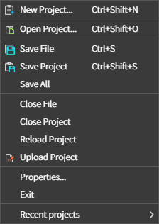
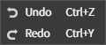
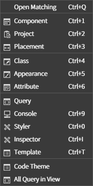
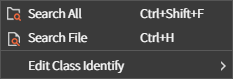
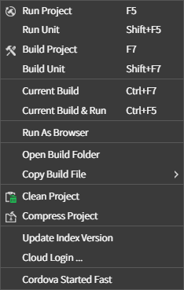
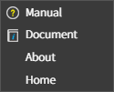
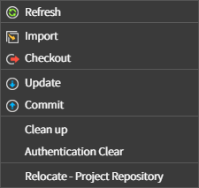

## 6. 각 메뉴 설명

### 6.1 File

* **New Project...** 새로운 프로젝트를 생성한다.
* **Oepn Project...** 기존에 만들어둔 프로젝트를 오픈한다.
* **SaveFile** 현재 오픈된 파일을 저장한다.
* **Save Project** 프로젝트 트리구성 및 프로젝트 설정의 변경사항을 저장한다.
* **Save All** 프로젝트와 파일 전체를 저장한다.
* **Close File** 현재 오픈된 파일을 닫는다.
* **Close Project** 현재 오픈된 프로젝트를 닫는다.
* **Reload Project** 현재 오픈된 프로젝트를 다시 오픈한다.
* **Uplopad Project** ?
* **Properties...** 현재 오픈된 프로젝트의 설정 및 스파이더젠의 개인설정을 변경하는 설정창을 오픈한다.
* **Exit** 스파이더젠을 종료한다.
* **Recent Projects** 최근에 오픈한 프로젝트들의 리스트를 확인하거나 오픈한다.

### 6.2 Edit

* **Undo** 되돌리기
* **Redo** 다시하기

### 6.3 View

* **Open Matching** 현재 오픈된 cls 와 lay 파일의 각각 매칭된 파일을 오픈한다.
* **Component** 컴포넌트 리스트확인하거나 레이아웃에 컴포넌트를 추가할 수 있는 뷰를 오픈한다.
* **Project** 프로젝트 트리를 컨트롤하는 뷰를 오픈한다.
* **Placement** 레이아웃상에서 컴포넌트의 위치와 크기를 변경 하는 뷰를 오픈한다.
* **Class** 레이아웃상에서 컴포넌트의 클래스를 변경 할 수 있는 뷰를 오픈한다.
* **Appearance** 레이아웃상에서 컴포넌트의 외관을 변경할 수 있는 뷰를 오픈한다.
* **Attribute** 레이아웃상에서 컴포넌트의 속성을 변경할 수 있는 뷰를 오픈한다.
* **Query** 네트워크
* **Console** 각 작업 시 실행 결과가 표시되는 뷰를 오픈한다.
* **Styler** stl파일을 오픈하여 스타일을 제작하거나 편집하고 컴포넌트에 추가할 수 있는 뷰를 오픈한다.
* **Inspector** 레이아웃상에서 컴포넌트의 Html, ClassList, Css 를 확인하고 편집할 수 있는 뷰를 오픈한다.
* **Template** tlay파일에서 제작한 탬플릿을 레이아웃상에 바로 올려서 적용 시킬 수 있는 캔버스 뷰를 오픈한다.
* **Code Theme** 
* **All Query in View**

### 6.4 Search

* **Search All**
* **Search File**
* **Edit Class Identify**

### 6.5 Build

* **Run Project**
* **Run Unit**
* **Build Project**
* **Build Unit**
* **Current Build**
* **Current Build & Run**
* **Run As Browser**
* **Open Build Folder**
* **Copy Build File**
* **Clean Project**
* **Compress Project**
* **Update Index Version**
* **Cloud Login...**
* **Cordova Started Fast**

### 6.6 Help

* **Manual**
* **Document**
* **About**
* **Home**

### 6.7 Source Control

* **Refresh**
* **Import**
* **Checkout**
* **Update**
* **Commit**
* **Clean up**
* **Authentication Clear**
* **Relocate - Project Repository**
